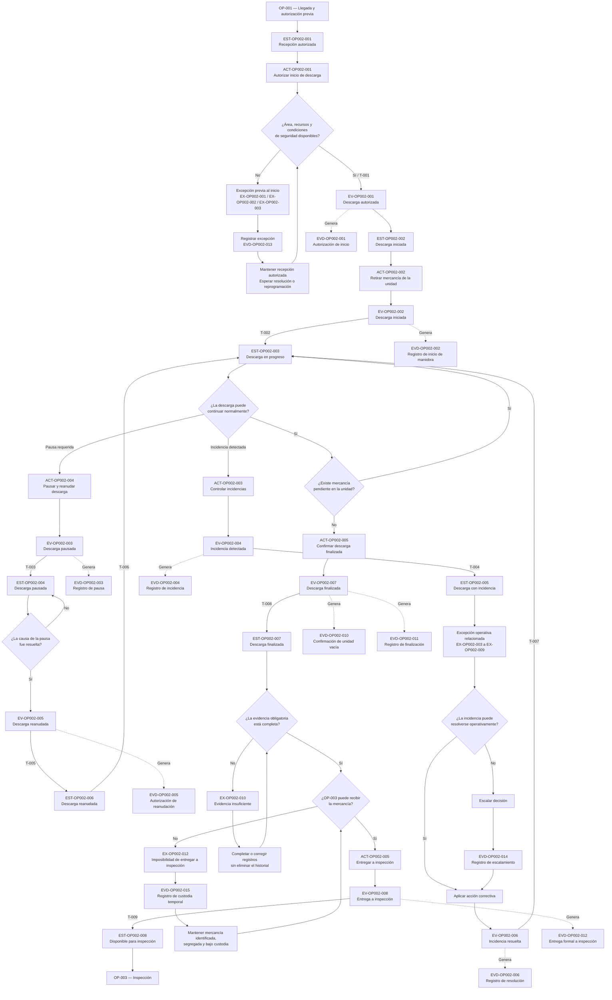
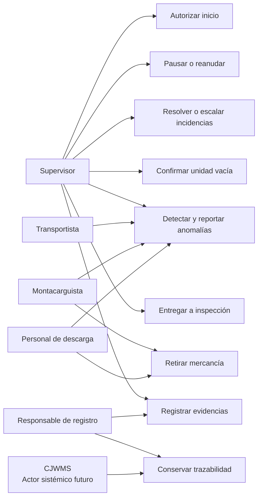

# OP-002 — Recepción Física

## 1. Identificación del proceso

| Campo                           | Definición                                                   |
| ------------------------------- | ------------------------------------------------------------ |
| Código del proceso              | OP-002                                                       |
| Nombre del proceso              | Recepción Física                                             |
| Dominio operativo               | Operación de entrada                                         |
| Tipo de proceso                 | Proceso operativo primario                                   |
| Estado documental               | En validación operativa                                      |
| Proceso anterior                | OP-001 — Llegada de la mercancía                             |
| Proceso posterior               | OP-003 — Inspección de la mercancía                          |
| Responsable operativo principal | Supervisor de almacén                                        |
| Actores participantes           | Supervisor de almacén, personal de descarga y montacarguista |
| Área física principal           | Área de recepción                                            |
| Marco de modelado               | Marco Conceptual Operativo de CJWMS                          |

---

## 2. Propósito del proceso

El proceso **OP-002 — Recepción Física** tiene como propósito controlar el ingreso físico de la mercancía al almacén desde el momento en que inicia su descarga hasta que queda colocada y disponible en el área de recepción para ser inspeccionada.

Este proceso permite establecer formalmente:

* qué mercancía fue descargada;
* cuándo comenzó y terminó la descarga;
* quiénes participaron en la operación;
* en qué área quedó colocada la mercancía;
* qué incidencias visibles ocurrieron durante la descarga;
* y en qué momento la mercancía quedó disponible para iniciar su inspección.

La recepción física no representa todavía la aceptación definitiva de la mercancía dentro del inventario.

La mercancía recibida físicamente deberá pasar posteriormente por el proceso **OP-003 — Inspección de la mercancía**, en el cual el supervisor validará su cantidad, estado físico, lote, caducidad y etiquetas.

---

## 3. Objetivo operativo

Asegurar que toda mercancía que ingresa físicamente al almacén:

1. sea descargada de manera controlada;
2. sea colocada en el área de recepción;
3. permanezca identificable durante la operación;
4. quede asociada con su llegada correspondiente;
5. registre cualquier incidencia ocurrida durante la descarga;
6. y sea entregada formalmente al proceso de inspección.

---

## 4. Resultado operativo esperado

El proceso concluye cuando la mercancía:

* ha sido completamente descargada;
* se encuentra físicamente en el área de recepción;
* puede ser identificada y relacionada con su operación de entrada;
* tiene registradas las incidencias visibles detectadas durante la descarga;
* y queda disponible para que el supervisor inicie la inspección.

El resultado operativo del proceso será:

> **Mercancía descargada y disponible para inspección en el área de recepción.**

---

## 5. Principio de control

La descarga física de la mercancía no implica por sí misma:

* la aceptación de las cantidades declaradas;
* la conformidad con el estado físico;
* la validación del lote o la caducidad;
* la confirmación de las etiquetas;
* la incorporación de la mercancía al inventario disponible;
* ni la asignación definitiva de una ubicación de almacenamiento.

Estas decisiones serán tomadas en los procesos operativos posteriores.

---

## 6. Relación con el Marco Conceptual Operativo

El proceso OP-002 será modelado utilizando los elementos oficiales del Marco Conceptual Operativo de CJWMS:

### Actores

Personas o entidades que participan en la recepción física y tienen una responsabilidad operativa definida.

### Estados

Condiciones operativas por las que atraviesa la recepción desde el inicio de la descarga hasta que la mercancía queda disponible para inspección.

### Actividades

Acciones ejecutadas por los actores para descargar, controlar, identificar y colocar la mercancía en el área de recepción.

### Eventos

Hechos relevantes que ocurren durante la recepción y que provocan un cambio de estado, generan evidencia o requieren una decisión.

### Procesos

Conjunto ordenado de actividades, estados, eventos, actores y reglas que permiten obtener un resultado operativo verificable.

---

## 7. Declaración de alcance inicial

OP-002 comprende exclusivamente la recepción física de la mercancía.

Incluye:

* preparación inmediata del área de recepción;
* apertura o acceso a la unidad de transporte;
* inicio de la descarga;
* retiro físico de la mercancía de la unidad;
* traslado inmediato al área de recepción;
* agrupación e identificación básica de lo descargado;
* detección de incidencias visibles durante la maniobra;
* finalización de la descarga;
* y entrega de la mercancía al proceso de inspección.

No incluye:

* inspección detallada de cantidad o calidad;
* aceptación o rechazo definitivo;
* registro como inventario disponible;
* asignación definitiva de ubicación;
* almacenamiento en racks;
* generación de recomendaciones de ubicación;
* ni traslado final a una posición Drive In o Selectiva.

---

## 8. Supuestos operativos inicialmente confirmados

Para el modelado inicial se consideran confirmados los siguientes hechos de la operación real:

1. La mercancía se descarga primero.
2. Después de la descarga, la mercancía se verifica en el área de recepción.
3. La inspección es realizada por el supervisor.
4. La mercancía no pasa directamente de la unidad de transporte a su ubicación definitiva sin ser revisada.
5. Después de una inspección satisfactoria, el supervisor indica la ubicación al montacarguista.
6. El montacarguista traslada posteriormente la mercancía a la ubicación asignada.
7. Actualmente, parte de la información operativa se registra en una hoja impresa.
8. La mercancía puede llegar ya paletizada o llegar a granel para ser paletizada por el almacén como un servicio adicional.

---

## 9. Criterio de validación de la microfase

La identificación y propósito de OP-002 se considerarán validados cuando se confirme que:

* el proceso comienza con la preparación o inicio de la descarga;
* el proceso termina antes de iniciar la inspección detallada;
* la mercancía permanece en el área de recepción durante la transición;
* la descarga no equivale a aceptación de inventario;
* y el resultado oficial es mercancía descargada y disponible para inspección.

---

## 10. Alcance operativo detallado

El proceso **OP-002 — Recepción Física** comprende el conjunto de actividades necesarias para transferir físicamente la mercancía desde la unidad de transporte hasta el área de recepción del almacén.

Su alcance comienza cuando existen las condiciones operativas para iniciar la descarga y concluye cuando toda la mercancía prevista para la operación ha sido retirada de la unidad, colocada en el área de recepción e identificada como disponible para inspección.

El proceso se concentra en el movimiento físico inicial de la mercancía y en la generación de evidencia básica sobre la ejecución de la descarga.

No determina todavía la aceptación, rechazo, disponibilidad en inventario ni ubicación definitiva de la mercancía.

---

## 11. Evento de inicio del proceso

El evento formal que inicia OP-002 es:

> **EV-OP002-001 — Descarga autorizada**

Este evento ocurre cuando el responsable operativo confirma que:

* la unidad de transporte se encuentra en el punto autorizado para descarga;
* la operación de llegada correspondiente puede ser identificada;
* existe autorización para abrir o acceder a la unidad;
* el área de recepción se encuentra disponible;
* existen condiciones mínimas de seguridad para realizar la maniobra;
* y se cuenta con el personal o equipo necesario para comenzar.

La llegada física de la unidad al almacén no inicia por sí sola OP-002.

Antes de la autorización pueden existir esperas, validaciones documentales, asignación de andén o instrucciones operativas correspondientes al proceso anterior.

---

## 12. Estado inicial del proceso

Al iniciar OP-002, la recepción se encuentra en el estado:

> **Recepción autorizada para descarga**

Este estado indica que la operación ya puede ejecutarse físicamente, pero que la mercancía aún permanece total o parcialmente dentro de la unidad de transporte.

Las condiciones mínimas del estado inicial son:

* unidad identificada;
* operación de entrada identificable;
* área de descarga definida;
* área de recepción disponible;
* descarga autorizada;
* mercancía aún no inspeccionada;
* y mercancía aún no incorporada al inventario disponible.

---

## 13. Entradas del proceso

OP-002 recibe como entradas operativas:

### 13.1 Unidad de transporte disponible

La unidad se encuentra colocada en el punto autorizado y en condiciones para permitir el acceso a la mercancía.

### 13.2 Operación de llegada identificada

Debe existir una referencia que permita relacionar la descarga con una llegada, entrega, proveedor, cliente, documento o movimiento esperado.

La identificación puede provenir inicialmente de:

* una hoja impresa;
* un documento de entrega;
* una orden de entrada;
* una referencia de transporte;
* una instrucción del supervisor;
* o un registro futuro de CJWMS.

### 13.3 Mercancía físicamente presente

La mercancía se encuentra dentro de la unidad y puede presentarse en diferentes condiciones:

* paletizada;
* en cajas;
* en piezas;
* en tambores;
* en bultos;
* o a granel.

### 13.4 Área de recepción disponible

Debe existir espacio físico suficiente para colocar temporalmente la mercancía sin mezclarla de manera descontrolada con otras operaciones.

### 13.5 Recursos operativos

La operación debe contar con los recursos necesarios según el tipo de mercancía y descarga:

* personal de descarga;
* montacarguista;
* montacargas;
* patín hidráulico;
* tarimas;
* equipo de protección;
* o materiales auxiliares.

### 13.6 Autorización operativa

El responsable correspondiente debe confirmar que la descarga puede comenzar.

---

## 14. Actividades incluidas en el alcance

Pertenecen a OP-002 las siguientes actividades generales:

1. confirmar la autorización de descarga;
2. preparar el área inmediata de recepción;
3. verificar que la unidad pueda abrirse o ser accedida de forma segura;
4. abrir o permitir el acceso a la unidad;
5. identificar visualmente la forma en que viene acondicionada la mercancía;
6. iniciar la descarga física;
7. retirar la mercancía de la unidad;
8. trasladarla al área de recepción;
9. mantener agrupada la mercancía correspondiente a la misma operación;
10. realizar una identificación operativa básica;
11. separar mercancía cuando exista una incidencia visible que requiera control;
12. registrar incidencias ocurridas durante la maniobra;
13. paletizar la mercancía cuando llegue a granel y el servicio forme parte de la operación;
14. confirmar que la unidad quedó completamente descargada;
15. ordenar el área para permitir la inspección;
16. y entregar formalmente la mercancía al proceso OP-003.

Estas actividades serán desglosadas posteriormente en una secuencia operativa detallada.

---

## 15. Actividades excluidas del alcance

No pertenecen a OP-002:

* la programación de la cita de transporte;
* la autorización de acceso del vehículo al almacén;
* la validación administrativa completa de documentos;
* la inspección detallada de cantidad;
* la evaluación formal del estado físico;
* la validación de lote;
* la revisión de caducidad;
* la validación de etiquetas;
* la aceptación definitiva de la mercancía;
* el rechazo definitivo de la mercancía;
* la liberación para inventario disponible;
* la recomendación de ubicación;
* la asignación definitiva de posición;
* la generación de una orden de almacenamiento;
* el traslado a racks;
* y la confirmación de almacenamiento.

Estas actividades pertenecen a otros procesos del flujo operativo.

---

## 16. Límites con procesos relacionados

### 16.1 Relación con OP-001 — Llegada de la mercancía

OP-001 entrega a OP-002:

* una unidad físicamente presente;
* una llegada identificada;
* una posición o punto autorizado de descarga;
* y la autorización para iniciar la maniobra.

OP-002 no debe iniciar mientras la descarga no haya sido autorizada.

### 16.2 Relación con OP-003 — Inspección de la mercancía

OP-002 entrega a OP-003:

* mercancía descargada;
* mercancía agrupada por operación de entrada;
* mercancía colocada en el área de recepción;
* identificación operativa básica;
* incidencias visibles registradas;
* y disponibilidad física para iniciar la revisión del supervisor.

OP-003 es responsable de validar formalmente:

* cantidad;
* estado físico;
* lote;
* caducidad;
* etiquetas;
* observaciones;
* y resultado de inspección.

### 16.3 Relación con el proceso de almacenamiento

OP-002 no entrega mercancía directamente al almacenamiento.

La mercancía solo podrá ser trasladada a una ubicación definitiva después de que los procesos posteriores determinen que puede continuar y que existe una ubicación asignada.

---

## 17. Frontera física del proceso

La frontera física principal de OP-002 se encuentra entre:

> **El interior de la unidad de transporte**

y

> **El área de recepción del almacén**

El proceso controla la transferencia física entre ambos puntos.

Un movimiento hacia una ubicación de rack no forma parte de OP-002, aunque el mismo montacarguista pueda participar posteriormente en dicho traslado.

---

## 18. Frontera informativa del proceso

Durante OP-002 solo se genera o confirma información básica necesaria para conservar el control de la operación.

Esta información puede incluir:

* referencia de la llegada;
* unidad de transporte;
* fecha y hora de inicio;
* fecha y hora de término;
* responsable de la maniobra;
* personal participante;
* equipo utilizado;
* forma de presentación de la mercancía;
* cantidad preliminar de unidades descargadas;
* ubicación temporal dentro del área de recepción;
* incidencias visibles;
* necesidad de paletización;
* y evidencia de descarga terminada.

Las cantidades registradas durante la descarga tendrán carácter preliminar hasta que sean confirmadas en OP-003.

---

## 19. Escenarios cubiertos por el alcance

OP-002 debe permitir representar al menos los siguientes escenarios:

### Escenario A — Mercancía paletizada

La mercancía llega sobre tarimas y puede ser retirada mediante montacargas o patín hidráulico.

### Escenario B — Mercancía en cajas o piezas

La mercancía requiere descarga manual, agrupación y posible colocación sobre tarimas.

### Escenario C — Mercancía a granel

La mercancía llega sin paletizar y el almacén realiza el servicio de paletización antes de entregarla a inspección.

### Escenario D — Descarga con incidencia visible

Durante la maniobra se detectan cajas rotas, tarimas dañadas, derrames, deformaciones, inestabilidad o cualquier condición visible que requiera registro y separación preventiva.

### Escenario E — Descarga parcial

La descarga no puede terminar en una sola ejecución debido a una interrupción operativa, falta de espacio, problema de equipo, condición insegura u otra causa.

### Escenario F — Diferentes presentaciones en una misma llegada

Una misma operación puede contener pallets, cajas, piezas, tambores u otras presentaciones que requieran métodos de descarga distintos.

---

## 20. Evento de finalización del proceso

El evento formal que termina OP-002 es:

> **EV-OP002-002 — Descarga física finalizada**

Este evento ocurre cuando se confirma que:

* toda la mercancía prevista para descargar fue retirada de la unidad;
* la mercancía se encuentra en el área de recepción;
* los grupos o unidades descargadas pueden relacionarse con la operación de entrada;
* las incidencias visibles de la maniobra fueron registradas;
* la unidad fue revisada para confirmar que no quedó mercancía pendiente;
* el área quedó en condiciones para realizar la inspección;
* y el supervisor puede iniciar OP-003.

---

## 21. Estado final del proceso

El estado final de OP-002 es:

> **Mercancía disponible para inspección**

Este estado significa que:

* la descarga física terminó;
* la mercancía ya no se encuentra dentro de la unidad;
* permanece bajo control en el área de recepción;
* aún no ha sido aceptada formalmente;
* aún no es inventario disponible;
* aún no cuenta necesariamente con una ubicación definitiva;
* y está lista para ser revisada por el supervisor.

---

## 22. Salidas del proceso

Las salidas operativas de OP-002 son:

### 22.1 Mercancía descargada

La mercancía fue retirada físicamente de la unidad.

### 22.2 Mercancía concentrada en recepción

La mercancía se encuentra colocada temporalmente en el área destinada para su revisión.

### 22.3 Identificación operativa básica

Cada grupo, pallet, conjunto o unidad descargada puede relacionarse con la llegada correspondiente.

### 22.4 Registro preliminar de descarga

Existe evidencia mínima de:

* inicio;
* término;
* participantes;
* equipo utilizado;
* presentación recibida;
* cantidad preliminar;
* y ubicación temporal.

### 22.5 Registro de incidencias

Las condiciones visibles ocurridas o identificadas durante la maniobra quedan registradas para su revisión posterior.

### 22.6 Entrega a inspección

El supervisor recibe la mercancía disponible para ejecutar OP-003.

---

## 23. Criterios de terminación correcta

OP-002 se considera terminado correctamente únicamente cuando:

1. no queda mercancía pendiente dentro de la unidad;
2. toda la mercancía descargada se encuentra bajo control en recepción;
3. la mercancía puede asociarse con su operación de llegada;
4. las incidencias visibles fueron identificadas;
5. la zona permite iniciar la inspección;
6. y existe una entrega operativa al supervisor.

La salida de la unidad de transporte no sustituye estos criterios.

---

## 24. Condiciones que impiden cerrar el proceso

OP-002 no puede declararse finalizado cuando:

* existe mercancía pendiente dentro de la unidad;
* se desconoce a qué llegada pertenece parte de la mercancía;
* la mercancía quedó colocada fuera del área autorizada sin control;
* existe una incidencia de seguridad sin resolver;
* la descarga fue interrumpida;
* falta realizar la paletización requerida;
* existen unidades descargadas sin identificación básica;
* no se registraron incidencias relevantes;
* o la mercancía aún no puede ser entregada al supervisor.

En estos casos, el proceso permanecerá abierto o pasará a un estado de excepción.

---

## 25. Resultado contractual entre procesos

La relación operativa entre OP-002 y OP-003 se establece mediante el siguiente resultado:

> **OP-002 entrega mercancía físicamente descargada, controlada e identificable; OP-003 determina si dicha mercancía cumple con las condiciones necesarias para ser aceptada, observada o rechazada.**

Esta separación evita que la ejecución de una maniobra física sea interpretada incorrectamente como una aceptación de inventario.

---

## 26. Criterio de validación de la microfase

La definición de alcance, inicio y final de OP-002 se considerará validada cuando se confirme que:

* el proceso inicia únicamente después de la autorización de descarga;
* su frontera física se limita al movimiento desde la unidad hasta recepción;
* la inspección formal no pertenece a OP-002;
* la paletización de mercancía a granel sí puede formar parte del proceso;
* la descarga puede permanecer abierta ante interrupciones;
* el proceso termina cuando toda la mercancía está controlada y disponible para inspección;
* y la salida no representa todavía aceptación ni disponibilidad de inventario.

---

## 27. Modelo de actores del proceso

El proceso **OP-002 — Recepción Física** requiere la participación coordinada de distintos actores operativos.

Cada actor interviene con responsabilidades específicas y dentro de límites claramente definidos.

La participación de una persona en varias actividades no elimina la separación conceptual de responsabilidades.

En almacenes pequeños, una misma persona puede ejecutar más de un rol. Sin embargo, CJWMS deberá conservar la distinción entre:

* quién autoriza;
* quién ejecuta;
* quién supervisa;
* quién registra;
* y quién confirma el resultado.

Esta separación permite mantener trazabilidad, control y claridad operativa.

---

## 28. Actor responsable principal

### ACT-OP-001 — Supervisor de almacén

El **Supervisor de almacén** es el responsable operativo principal de OP-002.

Su función es coordinar, autorizar y controlar la recepción física de la mercancía.

El supervisor no necesariamente ejecuta directamente todas las maniobras, pero sí conserva la responsabilidad de asegurar que el proceso se realice de manera controlada.

### 28.1 Responsabilidades del supervisor

Corresponde al supervisor:

1. confirmar que la unidad corresponde a una llegada identificada;
2. verificar que el área de recepción esté disponible;
3. validar que existan condiciones mínimas de seguridad;
4. autorizar el inicio de la descarga;
5. asignar o confirmar al personal participante;
6. indicar el punto donde debe colocarse la mercancía;
7. coordinar al personal de descarga y al montacarguista;
8. controlar que la mercancía de distintas operaciones no se mezcle;
9. ordenar la separación preventiva de mercancía con incidencia visible;
10. decidir si una descarga debe pausarse;
11. autorizar su reanudación;
12. confirmar que la unidad quedó completamente descargada;
13. verificar que la mercancía esté lista para inspección;
14. confirmar el cierre operativo de OP-002;
15. y recibir formalmente la mercancía para iniciar OP-003.

### 28.2 Decisiones permitidas

El supervisor puede decidir:

* iniciar la descarga;
* retrasar el inicio;
* suspender temporalmente la maniobra;
* cambiar el punto de colocación dentro del área de recepción;
* solicitar recursos adicionales;
* separar mercancía por una incidencia visible;
* requerir paletización;
* solicitar reacomodo de lo descargado;
* y declarar terminada la descarga.

### 28.3 Decisiones no pertenecientes a OP-002

Dentro de OP-002, el supervisor todavía no determina formalmente:

* la aceptación definitiva de la mercancía;
* el rechazo final;
* la cantidad validada;
* la conformidad de lote o caducidad;
* la disponibilidad en inventario;
* ni la ubicación definitiva en rack.

Estas decisiones corresponden a procesos posteriores.

---

## 29. Actor ejecutor de la maniobra

### ACT-OP-002 — Personal de descarga

El **Personal de descarga** ejecuta las actividades físicas necesarias para retirar la mercancía de la unidad de transporte y colocarla en el área de recepción.

Este actor puede estar integrado por:

* personal propio del almacén;
* ayudantes del transportista;
* personal del proveedor;
* personal externo autorizado;
* o una combinación de ellos.

### 29.1 Responsabilidades del personal de descarga

Corresponde al personal de descarga:

1. seguir las instrucciones del supervisor;
2. utilizar el equipo de protección requerido;
3. acceder a la unidad únicamente cuando esté autorizado;
4. retirar la mercancía con cuidado;
5. mantener la estabilidad de cajas, bultos o unidades;
6. evitar golpes, caídas, contaminación o mezcla;
7. colocar la mercancía en el punto indicado;
8. conservar agrupada la mercancía por operación;
9. informar inmediatamente cualquier daño o anomalía visible;
10. colaborar en la paletización cuando sea requerida;
11. mantener libre el área de tránsito;
12. y confirmar cuando la unidad aparentemente quedó vacía.

### 29.2 Límites de responsabilidad

El personal de descarga no debe:

* cambiar por iniciativa propia el área de colocación;
* mezclar mercancía de diferentes llegadas;
* retirar identificaciones existentes;
* ocultar daños detectados;
* decidir la aceptación de mercancía;
* asignar ubicaciones definitivas;
* ni trasladar mercancía directamente a rack sin instrucción posterior.

---

## 30. Actor operador de equipo

### ACT-OP-003 — Montacarguista

El **Montacarguista** ejecuta los movimientos que requieren montacargas u otro equipo autorizado.

Su participación dependerá del tipo de presentación, peso, volumen y condiciones de la mercancía.

### 30.1 Responsabilidades del montacarguista

Corresponde al montacarguista:

1. comprobar que el equipo esté disponible para la maniobra;
2. realizar una revisión operativa básica del montacargas;
3. seguir las instrucciones del supervisor;
4. retirar pallets o cargas de la unidad;
5. transportar la mercancía hasta el área de recepción;
6. colocarla en el punto temporal asignado;
7. conservar estabilidad y orientación segura;
8. mantener separación entre operaciones;
9. informar sobre pallets inestables, dañados o inseguros;
10. evitar movimientos no autorizados;
11. y dejar la mercancía accesible para su inspección.

### 30.2 Autoridad de seguridad

El montacarguista debe detener la maniobra cuando detecte:

* riesgo de caída;
* carga inestable;
* equipo defectuoso;
* espacio insuficiente;
* obstrucción;
* presencia de personas en zona de riesgo;
* daño estructural en la tarima;
* derrame;
* o cualquier condición insegura.

La detención por seguridad debe generar una notificación inmediata al supervisor.

### 30.3 Límites de responsabilidad

El montacarguista no determina:

* si la mercancía es aceptada;
* si las cantidades son correctas;
* si el lote o la caducidad cumplen;
* qué posición de rack será la definitiva;
* ni si la mercancía puede incorporarse al inventario.

Dentro de OP-002, su responsabilidad termina al colocar la mercancía bajo control en el área de recepción.

---

## 31. Actor externo relacionado

### ACT-OP-004 — Transportista

El **Transportista** es el actor responsable de la unidad que entrega la mercancía.

Puede ser el operador del vehículo o el representante de la empresa transportista.

### 31.1 Responsabilidades del transportista

Corresponde al transportista:

1. colocar la unidad en el punto autorizado;
2. mantenerla inmovilizada durante la descarga;
3. facilitar la apertura cuando le corresponda;
4. entregar o mostrar la documentación disponible;
5. informar condiciones especiales de la carga;
6. atender indicaciones de seguridad;
7. permanecer disponible cuando se requiera aclarar una incidencia;
8. y esperar la confirmación de descarga finalizada antes de retirar la unidad.

### 31.2 Límites de intervención

El transportista no debe:

* ordenar la descarga dentro del almacén;
* decidir dónde colocar la mercancía;
* retirar mercancía ya descargada sin autorización;
* alterar los registros del almacén;
* ni dar por concluida unilateralmente la recepción.

La salida de la unidad deberá ocurrir de acuerdo con las reglas del proceso correspondiente.

---

## 32. Actor propietario o remitente de la mercancía

### ACT-OP-005 — Proveedor o cliente remitente

El **Proveedor o cliente remitente** es la entidad que origina o envía la mercancía al almacén.

Puede no estar físicamente presente durante OP-002, pero permanece relacionado con la operación mediante:

* documentos;
* referencias;
* instrucciones;
* presentación esperada;
* condiciones comerciales;
* y servicios solicitados.

### 32.1 Responsabilidades relacionadas

Debe proporcionar, directa o indirectamente:

* información suficiente para identificar la entrega;
* descripción de la mercancía;
* condiciones especiales de manipulación;
* presentación esperada;
* y autorización de servicios adicionales cuando corresponda.

### 32.2 Participación en OP-002

El proveedor o cliente remitente normalmente no ejecuta la descarga ni controla la maniobra interna.

Su participación es informativa y contractual.

Cuando exista una diferencia o incidencia, podrá ser notificado en procesos posteriores.

---

## 33. Actor de registro operativo

### ACT-OP-006 — Responsable de registro

El **Responsable de registro** documenta la ejecución de la recepción física.

Esta responsabilidad puede ser asumida por:

* el supervisor;
* un auxiliar administrativo;
* un capturista;
* un operador autorizado;
* o, en el futuro, mediante CJWMS con confirmaciones de los actores.

### 33.1 Responsabilidades de registro

Corresponde a este actor:

1. identificar la operación de llegada;
2. registrar fecha y hora de inicio;
3. registrar participantes;
4. registrar el equipo utilizado;
5. anotar la presentación de la mercancía;
6. registrar cantidades preliminares;
7. documentar incidencias visibles;
8. registrar pausas y reanudaciones;
9. indicar si fue necesaria paletización;
10. registrar fecha y hora de finalización;
11. y conservar la evidencia de entrega a inspección.

### 33.2 Principio de fidelidad

El responsable de registro debe documentar lo ocurrido y no modificar la realidad operativa para hacerla coincidir con lo esperado.

Cuando exista una diferencia, deberá registrarse como:

* observación;
* incidencia;
* dato pendiente;
* o excepción.

### 33.3 Situación actual

En la operación actual, parte de esta información se registra mediante una hoja impresa.

Durante la validación posterior deberá determinarse:

* quién llena la hoja;
* en qué momento se llena;
* qué campos contiene;
* quién la firma;
* dónde se conserva;
* y qué información deberá migrar a CJWMS.

---

## 34. Actor sistémico futuro

### ACT-SYS-001 — CJWMS

CJWMS actuará como soporte digital del proceso, pero no sustituirá la responsabilidad física ni la autoridad de los actores humanos.

### 34.1 Responsabilidades futuras de CJWMS

El sistema podrá:

* identificar la operación;
* mostrar la llegada esperada;
* registrar la autorización de descarga;
* asignar un identificador de recepción;
* registrar actores participantes;
* registrar eventos;
* controlar estados;
* documentar incidencias;
* conservar evidencia;
* registrar pausas y reanudaciones;
* generar alertas;
* y preparar la entrega digital a OP-003.

### 34.2 Límites del sistema

CJWMS no deberá:

* asumir que la descarga terminó sin confirmación;
* aceptar mercancía automáticamente por haber sido descargada;
* ocultar inconsistencias;
* modificar cantidades sin trazabilidad;
* ni reemplazar la decisión del supervisor en situaciones físicas o de seguridad.

---

## 35. Matriz general de responsabilidades

| Actividad o decisión             |            Supervisor | Personal de descarga |              Montacarguista |   Transportista | Responsable de registro |                CJWMS futuro |
| -------------------------------- | --------------------: | -------------------: | --------------------------: | --------------: | ----------------------: | --------------------------: |
| Confirmar operación identificada |           Responsable |            Informado |                   Informado |      Consultado |                   Apoya |           Valida referencia |
| Autorizar inicio                 |           Responsable |            Informado |                   Informado |       Informado |                Registra |             Controla estado |
| Abrir o permitir acceso          |             Supervisa |      Ejecuta o apoya |                   No aplica | Ejecuta o apoya |      Registra si aplica |             Registra evento |
| Retirar mercancía                |             Supervisa |          Responsable |      Responsable con equipo |    Puede apoyar |                Registra |                  No ejecuta |
| Colocar en recepción             |          Define punto |              Ejecuta |                     Ejecuta |       No decide |                Registra | Conserva ubicación temporal |
| Separar incidencia visible       |                Decide |              Ejecuta |                     Ejecuta |       Informado |                Registra |            Genera evidencia |
| Pausar descarga                  |                Decide |      Puede solicitar | Puede detener por seguridad |  Puede informar |                Registra |               Cambia estado |
| Reanudar descarga                |              Autoriza |              Ejecuta |                     Ejecuta |       Informado |                Registra |               Cambia estado |
| Confirmar unidad vacía           |           Responsable |                Apoya |                       Apoya |      Consultado |                Registra |       Conserva confirmación |
| Declarar descarga terminada      |           Responsable |            Informado |                   Informado |       Informado |                Registra |               Cierra estado |
| Iniciar inspección               | Responsable en OP-003 |            No aplica |                   No aplica |       No aplica |     Registra transición |  Habilita siguiente proceso |

---

## 36. Principio de segregación operativa

El modelo de actores de OP-002 se basa en la siguiente separación:

> **El supervisor autoriza y controla; el personal operativo ejecuta; el responsable de registro documenta; y CJWMS conserva la trazabilidad.**

Cuando una misma persona desempeñe varias funciones, el sistema deberá registrar el rol bajo el cual realizó cada acción.

Por ejemplo, una persona puede ser simultáneamente:

* supervisor;
* responsable de registro;
* y confirmador de cierre.

Sin embargo, cada acción deberá conservar su naturaleza y responsabilidad correspondiente.

---

## 37. Reglas de asignación de actores

Antes de iniciar OP-002 deberán conocerse, al menos:

* supervisor responsable;
* persona o equipo que realizará la descarga;
* montacarguista, cuando sea necesario;
* responsable de registro;
* y transportista asociado a la unidad.

La falta de un actor requerido puede impedir el inicio o provocar una espera operativa.

Ejemplos:

* sin supervisor no debe autorizarse la descarga;
* sin operador autorizado no debe utilizarse montacargas;
* sin responsable de registro no debe cerrarse la operación sin evidencia;
* y sin transportista disponible no debe abrirse una unidad cuando su participación sea obligatoria.

---

## 38. Sustitución de actores

Cuando un actor sea sustituido durante la ejecución, deberá registrarse:

* actor saliente;
* actor entrante;
* fecha y hora;
* motivo;
* estado de la recepción;
* y responsabilidades transferidas.

La sustitución no debe borrar las acciones ejecutadas por el actor anterior.

---

## 39. Escalamiento operativo

Las incidencias de OP-002 deberán escalarse inicialmente al supervisor.

El supervisor podrá requerir apoyo adicional cuando exista:

* riesgo de seguridad;
* daño significativo;
* falta de espacio;
* falla de equipo;
* mercancía no identificada;
* diferencia grave entre la presentación esperada y la recibida;
* derrame;
* material con manejo especial;
* o imposibilidad de concluir la descarga.

La definición de niveles de escalamiento adicionales se documentará posteriormente en las reglas y excepciones del proceso.

---

## 40. Evidencia mínima por actor

La trazabilidad de OP-002 deberá permitir identificar:

### Supervisor

* quién autorizó;
* quién pausó o reanudó;
* quién confirmó el cierre;
* y quién entregó la mercancía a inspección.

### Personal de descarga

* quién participó;
* en qué periodo;
* y en qué actividades relevantes intervino.

### Montacarguista

* quién operó el equipo;
* qué equipo utilizó;
* y qué movimientos ejecutó.

### Transportista

* nombre o identificación;
* unidad relacionada;
* empresa transportista;
* y participación en incidencias, cuando corresponda.

### Responsable de registro

* quién documentó;
* qué medio utilizó;
* y cuándo se realizó el registro.

---

## 41. Validaciones pendientes contra la operación real

Antes de consolidar definitivamente el modelo de actores, deberá confirmarse con el almacén:

1. quién autoriza actualmente el inicio de la descarga;
2. quién abre normalmente la unidad;
3. quién descarga la mercancía;
4. si el transportista participa físicamente;
5. quién opera el montacargas;
6. quién decide dónde colocar temporalmente la mercancía;
7. quién llena la hoja impresa;
8. quién firma o valida dicha hoja;
9. quién confirma que la unidad quedó vacía;
10. quién autoriza la salida del transporte;
11. y qué ocurre cuando el supervisor no está disponible.

Estas preguntas no invalidan el modelo inicial, pero deberán resolverse antes de declarar OP-002 completamente validado.

---

## 42. Criterio de validación de la microfase

El modelo de actores de OP-002 se considerará validado cuando se confirme que:

* el supervisor es el responsable principal;
* el personal de descarga ejecuta la maniobra física;
* el montacarguista participa cuando el movimiento requiere equipo;
* el transportista conserva responsabilidad sobre la unidad, pero no controla el proceso interno;
* existe una responsabilidad explícita de registro;
* CJWMS actúa como soporte y trazabilidad;
* los límites de decisión de cada actor son claros;
* y las responsabilidades pueden mantenerse aunque una persona ejerza varios roles.

---

## 43. Inventario de Estados Operativos

### 43.1 Propósito del modelo de estados

El proceso **OP-002 — Recepción Física** será gobernado mediante un conjunto de estados operativos que describen la condición real de la recepción durante toda su ejecución.

Un estado operativo representa la situación actual del proceso en un momento determinado.

Los estados:

* describen la condición del proceso;
* permiten conocer el avance real de la operación;
* habilitan o restringen determinadas actividades;
* sirven como base para la trazabilidad;
* permiten pausar y reanudar la operación;
* y constituyen el fundamento del motor de orquestación de CJWMS.

Los estados **no representan actividades**.

Una actividad puede modificar un estado, pero no es un estado en sí misma.

---

## 43.2 Principios del modelo de estados

El modelo de estados de OP-002 se basa en los siguientes principios:

### Un solo estado principal activo

En condiciones normales, la recepción física únicamente puede encontrarse en un estado principal a la vez.

Ejemplo:

Correcto:

* Descarga iniciada

Incorrecto:

* Descarga iniciada
* Descarga finalizada

Ambos estados no pueden coexistir.

---

### Los estados representan condiciones, no acciones

Ejemplo:

Correcto:

* Descarga en progreso

Incorrecto:

* Descargar mercancía

La acción pertenece al modelo de actividades.

---

### Los estados cambian únicamente mediante eventos

Un estado nunca cambia por el simple transcurso del tiempo.

Siempre existe un evento que provoca la transición.

Ejemplo:

Evento:

> Se inicia la descarga.

Cambio:

Recepción autorizada

↓

Descarga iniciada

---

### Todo cambio de estado debe ser trazable

Cada transición deberá conservar evidencia de:

* fecha;
* hora;
* actor responsable;
* evento que originó el cambio;
* observaciones, cuando existan.

---

### Los estados no dependen del sistema

Los estados representan la realidad física del almacén.

Aunque CJWMS no estuviera disponible, la operación seguiría transitando por los mismos estados.

El sistema únicamente registra dicha realidad.

---

## 43.3 Estados principales de OP-002

El ciclo de vida inicial del proceso se compone de los siguientes estados principales.

---

### EST-OP002-001 — Recepción autorizada

#### Descripción

La descarga ha sido autorizada pero aún no ha comenzado físicamente.

#### Características

* unidad disponible;
* área preparada;
* recursos disponibles;
* supervisor autorizó;
* mercancía permanece dentro de la unidad.

#### Estado inicial

Sí.

#### Estado final

No.

---

### EST-OP002-002 — Descarga iniciada

#### Descripción

Ha comenzado el retiro físico de la mercancía desde la unidad.

#### Características

* existe movimiento físico;
* primera unidad retirada;
* inicio formal de la maniobra.

#### Estado inicial

No.

#### Estado final

No.

---

### EST-OP002-003 — Descarga en progreso

#### Descripción

La recepción continúa ejecutándose normalmente.

#### Características

* mercancía siendo descargada;
* operación activa;
* recursos trabajando;
* unidad aún contiene mercancía.

#### Estado inicial

No.

#### Estado final

No.

---

### EST-OP002-004 — Descarga pausada

#### Descripción

La descarga fue suspendida temporalmente sin cancelar el proceso.

#### Ejemplos

* falta de espacio;
* avería del montacargas;
* condición insegura;
* lluvia;
* incidencia operativa;
* espera de instrucciones.

#### Características

* proceso abierto;
* maniobra detenida;
* puede reanudarse posteriormente.

---

### EST-OP002-005 — Descarga con incidencia

#### Descripción

Durante la recepción se detectó una condición que requiere atención antes de continuar normalmente.

Ejemplos:

* pallet colapsado;
* cajas dañadas;
* derrame;
* mercancía sin identificar;
* riesgo de seguridad.

Este estado no implica necesariamente que la descarga termine.

Puede resolverse y continuar.

---

### EST-OP002-006 — Descarga reanudada

#### Descripción

La operación había sido pausada y posteriormente fue autorizada para continuar.

#### Características

* mantiene continuidad;
* conserva trazabilidad;
* no reinicia la recepción.

---

### EST-OP002-007 — Descarga finalizada

#### Descripción

Toda la mercancía fue retirada físicamente de la unidad.

#### Características

* unidad vacía;
* mercancía en recepción;
* descarga concluida.

Todavía no implica aceptación.

---

### EST-OP002-008 — Disponible para inspección

#### Descripción

La mercancía ya puede entregarse formalmente al proceso OP-003.

#### Características

* mercancía controlada;
* agrupada;
* identificable;
* lista para inspección.

#### Estado final del proceso

Sí.

---

## 43.4 Clasificación de estados

Los estados del proceso se clasifican de la siguiente forma:

### Estado inicial

* Recepción autorizada

---

### Estados de ejecución

* Descarga iniciada
* Descarga en progreso
* Descarga reanudada

---

### Estados de suspensión

* Descarga pausada

---

### Estados de atención especial

* Descarga con incidencia

---

### Estados de cierre

* Descarga finalizada
* Disponible para inspección

---

## 43.5 Estados descartados

Durante el análisis se decidió no incorporar estados como:

* Descarga aceptada
* Inventario disponible
* Ubicación asignada
* Mercancía almacenada

Estos pertenecen a procesos posteriores.

Mantener esta separación evita mezclar responsabilidades entre OP-002 y los procesos siguientes.

---

## 43.6 Estado oficial de cierre

Aunque la descarga termina físicamente en:

> Descarga finalizada

el proceso OP-002 únicamente concluye cuando la mercancía alcanza el estado:

> Disponible para inspección

Este criterio garantiza que la recepción entregue formalmente el control al siguiente proceso y no solo marque el fin de la maniobra física.

---

## 43.7 Resumen del inventario de estados

| Código        | Estado                     | Tipo              |
| ------------- | -------------------------- | ----------------- |
| EST-OP002-001 | Recepción autorizada       | Inicial           |
| EST-OP002-002 | Descarga iniciada          | Ejecución         |
| EST-OP002-003 | Descarga en progreso       | Ejecución         |
| EST-OP002-004 | Descarga pausada           | Suspensión        |
| EST-OP002-005 | Descarga con incidencia    | Atención especial |
| EST-OP002-006 | Descarga reanudada         | Ejecución         |
| EST-OP002-007 | Descarga finalizada        | Cierre operativo  |
| EST-OP002-008 | Disponible para inspección | Estado final      |

---

## 43.8 Criterio de validación de la microfase

El inventario de estados de OP-002 se considerará validado cuando se confirme que:

* existe un único estado inicial;
* existe un único estado final;
* los estados representan condiciones operativas y no actividades;
* las pausas e incidencias tienen representación explícita;
* el cierre físico de la descarga se distingue del cierre formal del proceso;
* y todos los estados pueden ser explicados utilizando la operación real del almacén.

--

## 44. Modelo de Transiciones entre Estados Operativos

### 44.1 Propósito del modelo de transiciones

El inventario de estados define las condiciones posibles del proceso.

El modelo de transiciones define **cómo puede evolucionar el proceso entre dichas condiciones**.

Una transición representa el cambio válido desde un estado origen hacia un estado destino como consecuencia de un evento operativo.

Cada transición deberá ser:

* válida desde el punto de vista operativo;
* consistente con la realidad física del almacén;
* provocada por un evento identificable;
* registrada para efectos de trazabilidad.

---

## 44.2 Principios de las transiciones

Las transiciones del proceso OP-002 obedecen los siguientes principios:

### Transición controlada

Todo cambio de estado requiere un evento.

No existen cambios automáticos sin causa.

---

### Transición válida

Una transición únicamente puede ocurrir cuando el estado origen lo permite.

No es posible saltar estados arbitrariamente.

---

### Transición verificable

Cada transición debe conservar evidencia de:

* estado origen;
* estado destino;
* evento que la originó;
* actor responsable;
* fecha y hora;
* observaciones, cuando existan.

---

### Transición reversible solo cuando la operación lo permita

No todas las transiciones pueden deshacerse.

Por ejemplo:

Una descarga pausada puede volver a ejecutarse.

Una descarga finalizada no puede regresar a "descarga iniciada".

---

## 44.3 Matriz oficial de transiciones

| Estado origen           | Evento                 | Estado destino             |
| ----------------------- | ---------------------- | -------------------------- |
| Recepción autorizada    | Inicio de descarga     | Descarga iniciada          |
| Descarga iniciada       | Descarga continua      | Descarga en progreso       |
| Descarga en progreso    | Pausa operativa        | Descarga pausada           |
| Descarga en progreso    | Incidencia detectada   | Descarga con incidencia    |
| Descarga pausada        | Reanudación autorizada | Descarga reanudada         |
| Descarga reanudada      | Descarga continúa      | Descarga en progreso       |
| Descarga con incidencia | Incidencia resuelta    | Descarga en progreso       |
| Descarga en progreso    | Descarga terminada     | Descarga finalizada        |
| Descarga finalizada     | Entrega a inspección   | Disponible para inspección |

---

## 44.4 Descripción de cada transición

### T-001

Recepción autorizada

↓

Descarga iniciada

Evento:

Inicio físico de la descarga.

---

### T-002

Descarga iniciada

↓

Descarga en progreso

Evento:

La maniobra continúa normalmente después de retirar las primeras unidades.

---

### T-003

Descarga en progreso

↓

Descarga pausada

Evento:

Se presenta una condición que obliga a detener temporalmente la operación.

Ejemplos:

* falta de espacio;
* equipo averiado;
* lluvia;
* espera de instrucciones.

---

### T-004

Descarga en progreso

↓

Descarga con incidencia

Evento:

Durante la maniobra se detecta una condición que requiere atención.

Ejemplos:

* pallet roto;
* mercancía dañada;
* derrame;
* carga inestable.

---

### T-005

Descarga pausada

↓

Descarga reanudada

Evento:

El supervisor autoriza continuar la maniobra.

---

### T-006

Descarga reanudada

↓

Descarga en progreso

Evento:

La descarga vuelve a ejecutarse normalmente.

---

### T-007

Descarga con incidencia

↓

Descarga en progreso

Evento:

La incidencia fue controlada o quedó documentada sin impedir la continuidad.

---

### T-008

Descarga en progreso

↓

Descarga finalizada

Evento:

Toda la mercancía fue retirada de la unidad.

---

### T-009

Descarga finalizada

↓

Disponible para inspección

Evento:

El supervisor confirma la entrega formal al proceso OP-003.

---

## 44.5 Transiciones no permitidas

El proceso prohíbe expresamente transiciones como:

Recepción autorizada

↓

Descarga finalizada

---

Descarga iniciada

↓

Disponible para inspección

---

Descarga pausada

↓

Descarga finalizada

(sin reanudar previamente)

---

Descarga finalizada

↓

Descarga en progreso

---

Disponible para inspección

↓

Descarga iniciada

---

Descarga con incidencia

↓

Disponible para inspección

(sin resolver la incidencia o definir su tratamiento)

Estas restricciones preservan la coherencia del proceso.

---

## 44.6 Transiciones condicionales

Algunas transiciones dependen de reglas adicionales.

Ejemplos:

Una descarga pausada solo puede reanudarse cuando:

* desaparece la condición que provocó la pausa;
* el supervisor autoriza continuar;
* existen recursos suficientes.

Una incidencia solo puede cerrarse cuando:

* fue atendida;
* quedó documentada;
* o se decidió continuar bajo observación.

Estas reglas se formalizarán en la sección correspondiente.

---

## 44.7 Ciclos permitidos

El proceso admite ciclos controlados.

Ejemplo:

Descarga en progreso

↓

Descarga pausada

↓

Descarga reanudada

↓

Descarga en progreso

Este ciclo puede repetirse varias veces durante una misma recepción.

Cada repetición deberá conservar trazabilidad independiente.

---

## 44.8 Ciclos no permitidos

No se permiten ciclos como:

Descarga finalizada

↓

Descarga en progreso

o

Disponible para inspección

↓

Recepción autorizada

Una vez alcanzados estos estados, la recepción deberá considerarse cerrada.

---

## 44.9 Transición terminal

La transición:

Descarga finalizada

↓

Disponible para inspección

representa la transición terminal de OP-002.

A partir de este punto el control operativo corresponde al proceso OP-003.

---

## 44.10 Integridad del proceso

Toda ejecución correcta de OP-002 deberá cumplir:

* comenzar en el estado inicial;
* seguir únicamente transiciones válidas;
* finalizar en el estado final;
* conservar evidencia de cada transición.

Si alguna transición obligatoria no existe, la ejecución deberá considerarse incompleta.

---

## 44.11 Resumen gráfico del flujo de estados

```text
Recepción autorizada
        │
        ▼
Descarga iniciada
        │
        ▼
Descarga en progreso
        │
 ┌──────┴──────────┐
 ▼                 ▼
Descarga      Descarga
pausada     con incidencia
 │                 │
 ▼                 ▼
Descarga      Incidencia
reanudada      resuelta
 │                 │
 └──────┬──────────┘
        ▼
Descarga en progreso
        │
        ▼
Descarga finalizada
        │
        ▼
Disponible para inspección
```

---

## 44.12 Validación de consistencia

El modelo de transiciones se considera consistente cuando:

* todas las transiciones tienen estado origen y destino;
* ningún estado queda aislado;
* el proceso posee un único estado inicial;
* el proceso posee un único estado final;
* existen mecanismos para pausa e incidencia;
* y todas las rutas posibles representan situaciones reales del almacén.

---

## 44.13 Criterio de validación de la microfase

La microfase se considerará validada cuando se confirme que:

* todas las transiciones son físicamente posibles;
* no existen saltos incompatibles con la operación real;
* las pausas e incidencias conservan continuidad;
* el cierre del proceso solo ocurre mediante la transición terminal;
* y cualquier recorrido completo del proceso puede explicarse utilizando exclusivamente estas transiciones.

---

## 45. Reglas de Cambio de Estado

### 45.1 Propósito

Las reglas de cambio de estado definen las condiciones que deben cumplirse para que una transición entre estados operativos sea válida.

Mientras que el modelo de transiciones responde a la pregunta:

> **¿Hacia qué estado puede evolucionar el proceso?**

Las reglas responden a:

> **¿Está permitido realizar esa transición en este momento?**

Toda transición deberá cumplir las reglas asociadas antes de ejecutarse.

---

## 45.2 Estructura de una regla

Cada regla operativa estará compuesta por los siguientes elementos:

* Identificador.
* Nombre.
* Descripción.
* Justificación operativa.
* Consecuencia si no se cumple.

Esta estructura será utilizada de forma uniforme en todos los procesos de CJWMS.

---

## 45.3 Reglas generales

### R-OP002-001 — Inicio autorizado

**Descripción**

La descarga únicamente podrá iniciar cuando exista autorización del supervisor.

**Justificación**

Garantiza que la operación se realice bajo control.

**Consecuencia**

El proceso permanecerá en:

> Recepción autorizada.

---

### R-OP002-002 — Unidad disponible

**Descripción**

No podrá iniciarse la descarga si la unidad aún no se encuentra correctamente posicionada y disponible.

**Justificación**

Evita maniobras inseguras o incompletas.

**Consecuencia**

La transición hacia "Descarga iniciada" será rechazada.

---

### R-OP002-003 — Área de recepción disponible

**Descripción**

Debe existir espacio suficiente para colocar la mercancía.

**Justificación**

Evita bloqueos y mezclas de operaciones.

**Consecuencia**

La descarga deberá permanecer pendiente hasta liberar espacio.

---

### R-OP002-004 — Recursos suficientes

**Descripción**

La descarga únicamente podrá iniciar cuando existan los recursos mínimos requeridos.

Ejemplos:

* personal;
* montacargas;
* patín hidráulico;
* tarimas;
* equipo de seguridad.

**Consecuencia**

La operación permanecerá detenida.

---

### R-OP002-005 — Seguridad primero

**Descripción**

Toda condición insegura obliga a detener inmediatamente la descarga.

**Justificación**

La seguridad tiene prioridad sobre la continuidad operativa.

**Consecuencia**

El estado cambiará a:

> Descarga pausada.

---

## 45.4 Reglas durante la ejecución

### R-OP002-006 — Conservación de identidad

La mercancía perteneciente a diferentes operaciones no deberá mezclarse.

---

### R-OP002-007 — Registro de incidencias

Toda incidencia visible deberá registrarse antes de continuar o cerrar la recepción.

---

### R-OP002-008 — Continuidad controlada

Una descarga pausada únicamente podrá reanudarse mediante autorización del supervisor.

---

### R-OP002-009 — Resolución de incidencias

Cuando exista una incidencia, deberá definirse una de las siguientes acciones:

* resolver;
* documentar;
* aislar;
* o escalar.

No podrá ignorarse.

---

### R-OP002-010 — Evidencia obligatoria

Todo cambio de estado deberá conservar evidencia de:

* fecha;
* hora;
* actor;
* evento;
* observaciones cuando existan.

---

## 45.5 Reglas para el cierre

### R-OP002-011 — Unidad completamente descargada

No podrá declararse finalizada la descarga mientras exista mercancía pendiente dentro de la unidad.

---

### R-OP002-012 — Mercancía bajo control

Toda la mercancía descargada deberá encontrarse dentro del área autorizada de recepción.

---

### R-OP002-013 — Identificación mínima

Toda mercancía deberá poder asociarse con su operación de llegada.

---

### R-OP002-014 — Incidencias tratadas

Las incidencias detectadas deberán encontrarse:

* resueltas;
* documentadas;
* o formalmente escaladas.

---

### R-OP002-015 — Entrega formal

La transición hacia:

> Disponible para inspección

únicamente podrá realizarse cuando el supervisor confirme la entrega del proceso OP-002 al proceso OP-003.

---

## 45.6 Reglas de integridad

### R-OP002-016

El proceso deberá comenzar únicamente desde el estado inicial.

---

### R-OP002-017

El proceso deberá finalizar únicamente en el estado oficial de cierre.

---

### R-OP002-018

No se permiten transiciones que omitan estados obligatorios.

---

### R-OP002-019

No se permite regresar desde un estado final hacia estados de ejecución.

---

### R-OP002-020

Toda transición deberá corresponder con un evento registrado.

---

## 45.7 Priorización de reglas

Cuando varias reglas sean aplicables simultáneamente, se seguirá el siguiente orden de prioridad:

1. Seguridad.
2. Integridad física de la mercancía.
3. Trazabilidad.
4. Continuidad operativa.
5. Productividad.

Este orden permitirá resolver conflictos de decisión de forma consistente.

---

## 45.8 Incumplimiento de reglas

Cuando una regla no pueda cumplirse, el sistema o el responsable operativo deberá:

* impedir la transición;
* mantener el estado actual; o
* mover el proceso a un estado de excepción, según corresponda.

En ningún caso deberá ejecutarse una transición inválida.

---

## 45.9 Matriz de reglas por transición

| Transición | Reglas mínimas                                     |
| ---------- | -------------------------------------------------- |
| T-001      | R-OP002-001, R-OP002-002, R-OP002-003, R-OP002-004 |
| T-002      | R-OP002-006                                        |
| T-003      | R-OP002-005                                        |
| T-004      | R-OP002-007                                        |
| T-005      | R-OP002-008                                        |
| T-006      | R-OP002-010                                        |
| T-007      | R-OP002-009                                        |
| T-008      | R-OP002-011, R-OP002-012, R-OP002-013, R-OP002-014 |
| T-009      | R-OP002-015                                        |

---

## 45.10 Reutilización de reglas

Las reglas definidas en OP-002 forman parte del marco operativo de CJWMS y podrán reutilizarse, adaptarse o especializarse en otros procesos cuando la lógica operativa sea equivalente.

Esta reutilización deberá realizarse mediante referencia al identificador de la regla original, evitando duplicar definiciones y favoreciendo la consistencia de la arquitectura.

---

## 45.11 Criterio de validación de la microfase

La microfase se considerará validada cuando:

* cada transición tenga reglas asociadas;
* todas las reglas posean identificador único;
* exista una consecuencia definida para su incumplimiento;
* la prioridad entre reglas sea consistente;
* y el conjunto de reglas permita controlar completamente el cambio de estado del proceso.

---

## 46. Catálogo Oficial de Eventos Operativos

### 46.1 Propósito del modelo de eventos

El modelo de eventos identifica los hechos relevantes que ocurren durante la ejecución de OP-002 y que modifican el comportamiento del proceso.

Cada evento constituye un registro objetivo de algo que realmente sucedió durante la operación.

Los eventos permiten:

* activar transiciones de estado;
* generar evidencia;
* construir la trazabilidad completa del proceso;
* sincronizar procesos relacionados;
* y servir como base para auditoría, analítica e integración con otros sistemas.

---

## 46.2 Principios del modelo de eventos

Los eventos operativos de OP-002 cumplen los siguientes principios:

### Son hechos verificables

Un evento representa algo que efectivamente ocurrió.

No expresa una intención ni una actividad pendiente.

---

### Ocurren en un momento específico

Todo evento debe poder asociarse, al menos, con:

* fecha;
* hora;
* actor que lo originó o confirmó.

---

### Son inmutables

Una vez registrado, un evento no debe modificarse.

Si existe un error, deberá registrarse un nuevo evento que lo corrija o complemente, preservando el historial.

---

### Pueden generar transiciones

No todos los eventos cambian el estado del proceso.

Sin embargo, todo cambio de estado debe estar respaldado por uno o más eventos.

---

## 46.3 Estructura estándar de un evento

Cada evento operativo se documentará con los siguientes elementos:

* Identificador.
* Nombre.
* Descripción.
* Actor que puede generarlo.
* Estado origen válido.
* Transición asociada (cuando aplique).
* Estado destino (cuando aplique).
* Reglas requeridas.
* Evidencia mínima.
* Resultado operativo.

---

## 46.4 Catálogo oficial de eventos

### EV-OP002-001 — Descarga autorizada

**Descripción**

El supervisor autoriza formalmente el inicio de la descarga.

**Actor**

Supervisor de almacén.

**Estado origen**

Recepción autorizada.

**Transición asociada**

T-001.

**Estado destino**

Descarga iniciada.

**Reglas requeridas**

* R-OP002-001
* R-OP002-002
* R-OP002-003
* R-OP002-004

**Evidencia mínima**

* Fecha y hora.
* Supervisor responsable.
* Identificación de la operación.

**Resultado operativo**

La descarga puede comenzar.

---

### EV-OP002-002 — Descarga iniciada

**Descripción**

Se retira físicamente la primera unidad de mercancía desde el transporte.

**Actor**

Personal de descarga o montacarguista.

**Estado origen**

Descarga iniciada.

**Transición asociada**

T-002.

**Estado destino**

Descarga en progreso.

**Reglas requeridas**

* R-OP002-006

**Evidencia mínima**

* Fecha y hora.
* Actor participante.
* Primera unidad descargada.

**Resultado operativo**

La recepción entra en ejecución.

---

### EV-OP002-003 — Descarga pausada

**Descripción**

La operación se detiene temporalmente.

**Actor**

Supervisor o montacarguista por motivos de seguridad.

**Estado origen**

Descarga en progreso.

**Transición asociada**

T-003.

**Estado destino**

Descarga pausada.

**Reglas requeridas**

* R-OP002-005

**Evidencia mínima**

* Motivo.
* Fecha y hora.
* Responsable.

**Resultado operativo**

La descarga permanece abierta pero suspendida.

---

### EV-OP002-004 — Incidencia detectada

**Descripción**

Se identifica una condición que requiere tratamiento antes o durante la continuidad de la descarga.

**Actor**

Cualquier actor participante.

**Estado origen**

Descarga en progreso.

**Transición asociada**

T-004.

**Estado destino**

Descarga con incidencia.

**Reglas requeridas**

* R-OP002-007

**Evidencia mínima**

* Tipo de incidencia.
* Descripción.
* Evidencia disponible.

**Resultado operativo**

La incidencia queda registrada y controlada.

---

### EV-OP002-005 — Descarga reanudada

**Descripción**

El supervisor autoriza continuar una descarga previamente pausada.

**Actor**

Supervisor.

**Estado origen**

Descarga pausada.

**Transición asociada**

T-005.

**Estado destino**

Descarga reanudada.

**Reglas requeridas**

* R-OP002-008

**Evidencia mínima**

* Motivo de reanudación.
* Fecha y hora.

**Resultado operativo**

La operación vuelve a ejecutarse.

---

### EV-OP002-006 — Incidencia resuelta

**Descripción**

La incidencia fue atendida, documentada o escalada y ya no impide continuar la descarga.

**Actor**

Supervisor.

**Estado origen**

Descarga con incidencia.

**Transición asociada**

T-007.

**Estado destino**

Descarga en progreso.

**Reglas requeridas**

* R-OP002-009

**Evidencia mínima**

* Acción realizada.
* Responsable.
* Fecha y hora.

**Resultado operativo**

La operación recupera su flujo normal.

---

### EV-OP002-007 — Descarga finalizada

**Descripción**

Se confirma que toda la mercancía fue retirada de la unidad de transporte.

**Actor**

Supervisor.

**Estado origen**

Descarga en progreso.

**Transición asociada**

T-008.

**Estado destino**

Descarga finalizada.

**Reglas requeridas**

* R-OP002-011
* R-OP002-012
* R-OP002-013
* R-OP002-014

**Evidencia mínima**

* Confirmación de unidad vacía.
* Fecha y hora.
* Responsable.

**Resultado operativo**

Concluye la maniobra física de descarga.

---

### EV-OP002-008 — Entrega a inspección

**Descripción**

El supervisor entrega formalmente la mercancía al proceso OP-003.

**Actor**

Supervisor.

**Estado origen**

Descarga finalizada.

**Transición asociada**

T-009.

**Estado destino**

Disponible para inspección.

**Reglas requeridas**

* R-OP002-015

**Evidencia mínima**

* Fecha y hora.
* Supervisor responsable.
* Confirmación de entrega.

**Resultado operativo**

OP-002 concluye y OP-003 queda habilitado para iniciar.

---

## 46.5 Clasificación de eventos

Los eventos de OP-002 se clasifican como:

### Eventos de autorización

* EV-OP002-001

### Eventos de ejecución

* EV-OP002-002
* EV-OP002-005
* EV-OP002-007

### Eventos de suspensión

* EV-OP002-003

### Eventos de control

* EV-OP002-004
* EV-OP002-006

### Eventos de transferencia

* EV-OP002-008

---

## 46.6 Principio de trazabilidad

Todo evento registrado deberá poder responder, como mínimo, las siguientes preguntas:

* ¿Qué ocurrió?
* ¿Cuándo ocurrió?
* ¿Quién lo provocó o confirmó?
* ¿En qué estado estaba el proceso?
* ¿Qué consecuencia produjo?

---

## 46.7 Criterio de validación de la microfase

El catálogo de eventos se considerará validado cuando:

* cada evento tenga un identificador único;
* exista una relación clara con estados, transiciones y reglas;
* los eventos representen hechos verificables;
* se conserve la trazabilidad mínima;
* y el conjunto de eventos describa completamente la evolución de OP-002.

---

## 47. Catálogo Oficial de Actividades Operativas

### 47.1 Propósito del modelo de actividades

Las actividades operativas representan el trabajo ejecutado por los actores durante la recepción física.

A diferencia de los estados, que describen la condición del proceso, las actividades representan acciones concretas que transforman la operación.

Cada actividad:

* consume entradas;
* requiere condiciones previas;
* ejecuta una acción;
* produce resultados;
* puede generar eventos;
* puede provocar cambios de estado;
* genera evidencia;
* y está gobernada por reglas operativas.

---

## 47.2 Estructura estándar de una actividad

Todas las actividades de CJWMS utilizarán la siguiente estructura:

* Identificador.
* Nombre.
* Objetivo.
* Actor responsable.
* Entradas.
* Precondiciones.
* Acciones.
* Salidas.
* Evento(s) generado(s).
* Estado esperado.
* Evidencias.
* Reglas relacionadas.

Esta estructura será utilizada en todos los procesos operativos del sistema.

---

## 47.3 ACT-OP002-001 — Autorizar inicio de descarga

### Objetivo

Autorizar formalmente el inicio de la recepción física.

### Actor responsable

Supervisor de almacén.

### Entradas

* Unidad identificada.
* Operación de llegada.
* Área disponible.
* Recursos mínimos.

### Precondiciones

* Recepción autorizada.
* Condiciones de seguridad verificadas.

### Acciones

* Confirmar la operación.
* Verificar disponibilidad.
* Autorizar el inicio.

### Salidas

* Descarga autorizada.

### Evento generado

* EV-OP002-001 — Descarga autorizada.

### Estado esperado

* Descarga iniciada.

### Evidencias

* Fecha.
* Hora.
* Supervisor.
* Observaciones.

### Reglas relacionadas

* R-OP002-001
* R-OP002-002
* R-OP002-003
* R-OP002-004

---

## 47.4 ACT-OP002-002 — Retirar mercancía de la unidad

### Objetivo

Transferir físicamente la mercancía desde la unidad de transporte al área de recepción.

### Actor responsable

Personal de descarga o montacarguista.

### Entradas

* Mercancía dentro de la unidad.
* Equipo disponible.

### Precondiciones

* Descarga autorizada.

### Acciones

* Retirar unidades.
* Manipular de forma segura.
* Trasladar al área de recepción.

### Salidas

* Mercancía descargada parcialmente o totalmente.

### Evento generado

* EV-OP002-002 — Descarga iniciada.

### Estado esperado

* Descarga en progreso.

### Evidencias

* Hora de inicio.
* Actor participante.
* Equipo utilizado.

### Reglas relacionadas

* R-OP002-006
* R-OP002-010

---

## 47.5 ACT-OP002-003 — Controlar incidencias durante la descarga

### Objetivo

Detectar y tratar oportunamente cualquier condición anómala observada durante la maniobra.

### Actor responsable

Supervisor.

### Entradas

* Mercancía en proceso de descarga.

### Precondiciones

* Descarga en progreso.

### Acciones

* Observar.
* Registrar.
* Clasificar.
* Determinar acción inmediata.

### Salidas

* Incidencia documentada o controlada.

### Evento generado

* EV-OP002-004 — Incidencia detectada.
* EV-OP002-006 — Incidencia resuelta (cuando aplique).

### Estado esperado

* Descarga con incidencia o Descarga en progreso.

### Evidencias

* Registro de incidencia.
* Fotografías, si existen.
* Observaciones.

### Reglas relacionadas

* R-OP002-007
* R-OP002-009

---

## 47.6 ACT-OP002-004 — Pausar y reanudar la descarga

### Objetivo

Suspender temporalmente la operación y restablecerla cuando existan condiciones para continuar.

### Actor responsable

Supervisor.

### Entradas

* Descarga en progreso.

### Precondiciones

* Existencia de una causa válida para la pausa.

### Acciones

* Detener la maniobra.
* Registrar el motivo.
* Autorizar la reanudación.

### Salidas

* Descarga pausada o reanudada.

### Eventos generados

* EV-OP002-003 — Descarga pausada.
* EV-OP002-005 — Descarga reanudada.

### Estado esperado

* Descarga pausada o Descarga en progreso.

### Evidencias

* Motivo.
* Responsable.
* Fecha y hora.

### Reglas relacionadas

* R-OP002-005
* R-OP002-008

---

## 47.7 ACT-OP002-005 — Confirmar descarga finalizada

### Objetivo

Verificar que toda la mercancía fue retirada de la unidad y que puede entregarse al proceso siguiente.

### Actor responsable

Supervisor.

### Entradas

* Descarga concluida físicamente.

### Precondiciones

* No existe mercancía pendiente.

### Acciones

* Revisar la unidad.
* Confirmar descarga total.
* Preparar la entrega a inspección.

### Salidas

* Descarga finalizada.

### Eventos generados

* EV-OP002-007 — Descarga finalizada.
* EV-OP002-008 — Entrega a inspección.

### Estado esperado

* Disponible para inspección.

### Evidencias

* Confirmación de unidad vacía.
* Responsable.
* Fecha y hora.

### Reglas relacionadas

* R-OP002-011
* R-OP002-012
* R-OP002-013
* R-OP002-014
* R-OP002-015

---

## 47.8 Principio de trazabilidad de actividades

Cada actividad deberá poder responder, como mínimo:

* ¿Quién la ejecutó?
* ¿Cuándo inició?
* ¿Cuándo terminó?
* ¿Qué produjo?
* ¿Qué evento generó?
* ¿Qué estado esperaba alcanzar?
* ¿Qué evidencia quedó registrada?

---

## 47.9 Relación entre actividades, eventos y estados

La siguiente tabla resume la relación principal del proceso:

| Actividad     | Evento principal            | Estado esperado                                  |
| ------------- | --------------------------- | ------------------------------------------------ |
| ACT-OP002-001 | EV-OP002-001                | Descarga iniciada                                |
| ACT-OP002-002 | EV-OP002-002                | Descarga en progreso                             |
| ACT-OP002-003 | EV-OP002-004 / EV-OP002-006 | Descarga con incidencia / Descarga en progreso   |
| ACT-OP002-004 | EV-OP002-003 / EV-OP002-005 | Descarga pausada / Descarga en progreso          |
| ACT-OP002-005 | EV-OP002-007 / EV-OP002-008 | Descarga finalizada / Disponible para inspección |

---

## 47.10 Criterio de validación de la microfase

El catálogo de actividades se considerará validado cuando:

* cada actividad tenga un identificador único;
* exista un actor responsable claramente definido;
* las entradas y salidas sean coherentes con la operación real;
* los eventos generados correspondan al catálogo oficial;
* las reglas relacionadas sean consistentes;
* y todas las actividades contribuyan al avance controlado del proceso OP-002.

---

## 48. Matriz de Trazabilidad Operativa

### 48.1 Propósito

La Matriz de Trazabilidad Operativa integra todos los elementos del proceso OP-002 en una única vista relacional.

Su objetivo es mostrar cómo interactúan:

* los actores;
* las actividades;
* los eventos;
* las transiciones;
* los estados;
* las evidencias;
* y las reglas operativas.

Esta matriz constituye el índice maestro del proceso y facilita la comprensión integral de su comportamiento.

---

## 48.2 Principios de trazabilidad

La trazabilidad de OP-002 se basa en los siguientes principios:

### Relación explícita

Toda actividad deberá relacionarse, al menos, con:

* un actor responsable;
* uno o más eventos;
* un estado esperado;
* una o más reglas;
* y la evidencia correspondiente.

---

### Navegación bidireccional

Será posible recorrer el proceso desde cualquier elemento.

Ejemplos:

* Actor → Actividad → Evento → Estado.
* Regla → Transición → Evento → Actividad.
* Estado → Evento → Actor.

---

### Consistencia

No deberán existir:

* actividades sin actor;
* eventos sin actividad asociada (cuando correspondan);
* transiciones sin reglas;
* estados inalcanzables;
* evidencias sin origen operativo.

---

### Reutilización

Los identificadores utilizados en la matriz deberán corresponder exactamente con los catálogos oficiales del proceso.

No se crearán identificadores adicionales.

---

## 48.3 Matriz oficial de trazabilidad

| Actor                                 | Actividad                                    | Evento                            | Transición | Estado destino             | Evidencia principal              | Reglas                                             |
| ------------------------------------- | -------------------------------------------- | --------------------------------- | ---------- | -------------------------- | -------------------------------- | -------------------------------------------------- |
| Supervisor                            | ACT-OP002-001 Autorizar inicio de descarga   | EV-OP002-001 Descarga autorizada  | T-001      | Descarga iniciada          | Autorización registrada          | R-OP002-001, R-OP002-002, R-OP002-003, R-OP002-004 |
| Personal de descarga / Montacarguista | ACT-OP002-002 Retirar mercancía de la unidad | EV-OP002-002 Descarga iniciada    | T-002      | Descarga en progreso       | Inicio de maniobra               | R-OP002-006, R-OP002-010                           |
| Supervisor                            | ACT-OP002-003 Controlar incidencias          | EV-OP002-004 Incidencia detectada | T-004      | Descarga con incidencia    | Registro de incidencia           | R-OP002-007                                        |
| Supervisor                            | ACT-OP002-003 Controlar incidencias          | EV-OP002-006 Incidencia resuelta  | T-007      | Descarga en progreso       | Evidencia de resolución          | R-OP002-009                                        |
| Supervisor                            | ACT-OP002-004 Pausar descarga                | EV-OP002-003 Descarga pausada     | T-003      | Descarga pausada           | Motivo de la pausa               | R-OP002-005                                        |
| Supervisor                            | ACT-OP002-004 Reanudar descarga              | EV-OP002-005 Descarga reanudada   | T-005      | Descarga reanudada         | Autorización de reanudación      | R-OP002-008                                        |
| Supervisor                            | ACT-OP002-005 Confirmar descarga finalizada  | EV-OP002-007 Descarga finalizada  | T-008      | Descarga finalizada        | Confirmación de unidad vacía     | R-OP002-011, R-OP002-012, R-OP002-013, R-OP002-014 |
| Supervisor                            | ACT-OP002-005 Entregar a inspección          | EV-OP002-008 Entrega a inspección | T-009      | Disponible para inspección | Entrega formal al proceso OP-003 | R-OP002-015                                        |

---

## 48.4 Cobertura del proceso

La matriz confirma que:

* todas las actividades tienen un actor responsable;
* todos los eventos provienen de una actividad identificada;
* todas las transiciones tienen reglas asociadas;
* todos los estados son alcanzables mediante una transición válida;
* y todas las evidencias tienen un origen operativo claramente definido.

---

## 48.5 Consultas de trazabilidad

La matriz permite responder preguntas como:

### Desde un actor

* ¿Qué actividades ejecuta?
* ¿Qué eventos puede generar?
* ¿Qué estados puede modificar?

---

### Desde una actividad

* ¿Quién la ejecuta?
* ¿Qué evento produce?
* ¿Qué reglas la gobiernan?
* ¿Qué evidencia genera?

---

### Desde un evento

* ¿Qué actividad lo originó?
* ¿Qué transición provocó?
* ¿Qué estado alcanzó?

---

### Desde una regla

* ¿Qué transición controla?
* ¿Qué actividades deben cumplirla?
* ¿Qué eventos dependen de ella?

---

### Desde un estado

* ¿Qué eventos permiten alcanzarlo?
* ¿Qué actividades conducen a él?
* ¿Qué reglas deben cumplirse?

---

## 48.6 Beneficios operativos

La Matriz de Trazabilidad Operativa permite:

* auditar la ejecución completa del proceso;
* identificar rápidamente el origen de una incidencia;
* validar la consistencia documental;
* facilitar la capacitación del personal;
* servir como base para pruebas funcionales;
* apoyar la implementación del motor de procesos;
* y proporcionar un contexto estructurado para análisis e inteligencia operativa.

---

## 48.7 Relación con el Motor de Orquestación Cognitiva

La matriz constituye una representación estructurada del conocimiento operativo de OP-002.

En futuras fases, el Motor de Orquestación Cognitiva podrá utilizar esta información para:

* validar transiciones;
* verificar reglas;
* explicar decisiones;
* reconstruir la secuencia de ejecución;
* detectar inconsistencias;
* y asistir al usuario con explicaciones basadas en la operación real.

---

## 48.8 Criterio de validación de la microfase

La Matriz de Trazabilidad Operativa se considerará validada cuando:

* todos los elementos del proceso estén representados;
* las relaciones sean consistentes con los catálogos oficiales;
* no existan actividades, eventos, transiciones o estados aislados;
* la navegación entre elementos sea posible en ambos sentidos;
* y la matriz permita reconstruir completamente la ejecución del proceso OP-002.

---

## 49. Catálogo Oficial de Reglas Operativas

### 49.1 Propósito

Las Reglas Operativas establecen las políticas y criterios que deben cumplirse durante la ejecución del proceso OP-002 — Recepción Física.

A diferencia de las Reglas de Cambio de Estado, estas reglas no controlan las transiciones del modelo de estados, sino la forma correcta en que debe desarrollarse la operación.

Su finalidad es garantizar seguridad, trazabilidad, calidad operativa y cumplimiento de los procedimientos establecidos por el almacén.

---

## 49.2 Clasificación de las reglas operativas

Para facilitar su administración, las reglas se agrupan en las siguientes categorías:

* Seguridad.
* Operación.
* Calidad.
* Trazabilidad.
* Documentación.
* Continuidad operativa.

---

## 49.3 Catálogo de reglas operativas

### RO-OP002-001 — Descarga en área autorizada

**Categoría:** Operación

Toda descarga deberá realizarse exclusivamente en el área de recepción autorizada por el almacén.

---

### RO-OP002-002 — Uso seguro del equipo

**Categoría:** Seguridad

Todo equipo de manejo de materiales deberá ser operado conforme a los procedimientos internos y únicamente por personal autorizado.

---

### RO-OP002-003 — Protección de la mercancía

**Categoría:** Calidad

La mercancía deberá manipularse de manera que se minimice el riesgo de daño físico durante la descarga.

---

### RO-OP002-004 — Registro de incidencias

**Categoría:** Trazabilidad

Toda incidencia detectada durante la descarga deberá registrarse antes de continuar con el proceso, salvo que exista un riesgo inmediato para la seguridad.

---

### RO-OP002-005 — Identificación continua

**Categoría:** Trazabilidad

La mercancía deberá conservar su identificación durante toda la recepción para evitar pérdidas de trazabilidad.

---

### RO-OP002-006 — Confirmación del cierre

**Categoría:** Documentación

Antes de declarar finalizada la descarga deberá confirmarse que no permanezca mercancía pendiente dentro de la unidad de transporte.

---

### RO-OP002-007 — Evidencia mínima obligatoria

**Categoría:** Documentación

Toda recepción deberá dejar evidencia suficiente para reconstruir la ejecución del proceso.

---

### RO-OP002-008 — Comunicación de anomalías

**Categoría:** Continuidad operativa

Cuando una anomalía impida continuar con la descarga, el Supervisor deberá comunicar la situación y definir la acción correspondiente antes de reanudar la operación.

---

## 49.4 Relación con otros modelos

Las Reglas Operativas complementan los modelos desarrollados previamente:

* Actores: definen quién debe cumplirlas.
* Actividades: establecen cómo deben ejecutarse.
* Eventos: determinan cuándo pueden originarse registros adicionales.
* Evidencias: especifican la información mínima que debe conservarse.

---

## 49.5 Principios de aplicación

Las Reglas Operativas deberán cumplir los siguientes principios:

* Ser comprensibles para el personal operativo.
* Ser verificables mediante evidencia.
* Ser aplicables de forma consistente.
* No contradecir las Reglas de Cambio de Estado.
* Mantener coherencia con las políticas generales del almacén.

---

## 49.6 Criterio de validación de la microfase

El Catálogo Oficial de Reglas Operativas se considerará validado cuando:

* todas las reglas sean claras y verificables;
* cada regla pertenezca a una categoría definida;
* no existan contradicciones con los modelos de estados, eventos o actividades;
* y las reglas reflejen fielmente la operación real del proceso OP-002.

---

## 50. Catálogo Oficial de Excepciones Operativas

### 50.1 Propósito

Las Excepciones Operativas representan situaciones que impiden, alteran o condicionan la ejecución normal del proceso OP-002 — Recepción Física.

Su propósito es establecer una respuesta controlada ante condiciones no previstas en el flujo principal, evitando decisiones improvisadas, pérdida de trazabilidad o continuidad operativa sin autorización.

Una excepción puede:

* impedir el inicio de la descarga;
* provocar una pausa;
* generar una incidencia;
* requerir una decisión del Supervisor;
* modificar temporalmente la ejecución;
* o impedir el cierre del proceso.

---

## 50.2 Principios del modelo de excepciones

Toda excepción deberá cumplir los siguientes principios:

### Identificación formal

La excepción deberá contar con un identificador único y una descripción clara.

### Registro obligatorio

Toda excepción que afecte el proceso deberá quedar documentada.

### Responsable definido

Deberá existir un actor responsable de analizarla y determinar la acción correspondiente.

### Continuidad controlada

La operación solamente podrá continuar cuando existan condiciones seguras y una decisión autorizada.

### Trazabilidad

La excepción deberá relacionarse con:

* el estado en el que ocurrió;
* la actividad afectada;
* el evento generado;
* la acción tomada;
* y la evidencia correspondiente.

### No eliminación del historial

La resolución de una excepción no deberá borrar ni sustituir su registro original.

---

## 50.3 Clasificación de excepciones

Las excepciones de OP-002 se clasifican en:

* Seguridad.
* Disponibilidad operativa.
* Condición de la mercancía.
* Identificación.
* Unidad de transporte.
* Recursos.
* Área de recepción.
* Continuidad operativa.
* Documentación y evidencia.

---

## 50.4 Estructura estándar de una excepción

Cada excepción deberá documentarse mediante:

* Identificador.
* Nombre.
* Categoría.
* Descripción.
* Condición de detección.
* Actor que la detecta.
* Responsable de decisión.
* Actividad afectada.
* Estado relacionado.
* Evento generado.
* Acción inmediata.
* Criterio de resolución.
* Resultado posible.
* Evidencia mínima.
* Reglas relacionadas.

---

## 50.5 EX-OP002-001 — Área de recepción no disponible

### Categoría

Disponibilidad operativa.

### Descripción

El área asignada para realizar la descarga se encuentra ocupada, bloqueada, restringida o en condiciones que impiden ejecutar la maniobra.

### Condición de detección

La excepción se detecta antes de iniciar la descarga o durante la operación si el área deja de estar disponible.

### Actor que la detecta

Supervisor, personal de descarga o montacarguista.

### Responsable de decisión

Supervisor.

### Actividad afectada

* ACT-OP002-001 — Autorizar inicio de descarga.
* ACT-OP002-002 — Retirar mercancía de la unidad.

### Estado relacionado

* Recepción autorizada.
* Descarga en progreso.

### Evento generado

* EV-OP002-003 — Descarga pausada, cuando la operación ya inició.
* Registro de excepción previo al inicio, cuando aún no existe descarga.

### Acción inmediata

* No iniciar la descarga, o
* detener temporalmente la maniobra.

### Criterio de resolución

El área deberá encontrarse disponible, segura y autorizada.

### Resultado posible

* Inicio autorizado.
* Descarga reanudada.
* Reasignación de área.
* Operación pospuesta.

### Evidencia mínima

* Motivo de indisponibilidad.
* Área afectada.
* Responsable de la decisión.
* Fecha y hora.
* Acción tomada.

### Reglas relacionadas

* R-OP002-003.
* R-OP002-005.
* RO-OP002-001.
* RO-OP002-008.

---

## 50.6 EX-OP002-002 — Equipo de manejo no disponible

### Categoría

Recursos.

### Descripción

No existe equipo disponible o el equipo asignado no se encuentra en condiciones adecuadas para realizar la descarga.

### Condición de detección

Antes del inicio o durante la maniobra.

### Actor que la detecta

Montacarguista, personal de descarga o Supervisor.

### Responsable de decisión

Supervisor.

### Actividad afectada

* ACT-OP002-001 — Autorizar inicio de descarga.
* ACT-OP002-002 — Retirar mercancía de la unidad.

### Estado relacionado

* Recepción autorizada.
* Descarga iniciada.
* Descarga en progreso.

### Evento generado

* EV-OP002-003 — Descarga pausada, cuando aplique.
* EV-OP002-004 — Incidencia detectada, cuando exista falla o riesgo.

### Acción inmediata

* No utilizar el equipo.
* Suspender la maniobra.
* Solicitar equipo alternativo.

### Criterio de resolución

Deberá existir equipo autorizado, disponible y en condiciones seguras.

### Resultado posible

* Sustitución del equipo.
* Reanudación de descarga.
* Reprogramación de la operación.

### Evidencia mínima

* Equipo afectado.
* Condición detectada.
* Responsable.
* Fecha y hora.
* Equipo sustituto, cuando aplique.

### Reglas relacionadas

* R-OP002-004.
* R-OP002-005.
* RO-OP002-002.
* RO-OP002-008.

---

## 50.7 EX-OP002-003 — Condición insegura durante la maniobra

### Categoría

Seguridad.

### Descripción

Se detecta una condición que representa riesgo para las personas, la mercancía, la infraestructura o el equipo.

### Condición de detección

En cualquier momento de la descarga.

### Actor que la detecta

Cualquier actor participante.

### Responsable de decisión

Supervisor.

### Actividad afectada

Cualquier actividad de ejecución física.

### Estado relacionado

* Descarga iniciada.
* Descarga en progreso.
* Descarga reanudada.

### Evento generado

* EV-OP002-003 — Descarga pausada.
* EV-OP002-004 — Incidencia detectada.

### Acción inmediata

Detener la operación de forma segura.

### Criterio de resolución

La condición de riesgo deberá eliminarse, controlarse o contar con una autorización formal para continuar.

### Resultado posible

* Descarga reanudada.
* Cambio de equipo.
* Cambio de área.
* Suspensión temporal.
* Cancelación operativa.

### Evidencia mínima

* Descripción del riesgo.
* Ubicación.
* Personas o equipos involucrados.
* Acción preventiva.
* Evidencia fotográfica, cuando exista.
* Autorización de reanudación.

### Reglas relacionadas

* R-OP002-005.
* R-OP002-007.
* R-OP002-008.
* R-OP002-009.
* RO-OP002-002.
* RO-OP002-008.

---

## 50.8 EX-OP002-004 — Mercancía dañada durante la descarga

### Categoría

Condición de la mercancía.

### Descripción

Se detecta daño físico visible en la mercancía, embalaje, pallet, contenedor o presentación durante la maniobra.

### Condición de detección

Durante el retiro, traslado o colocación en el área de recepción.

### Actor que la detecta

Personal de descarga, montacarguista o Supervisor.

### Responsable de decisión

Supervisor.

### Actividad afectada

* ACT-OP002-002 — Retirar mercancía de la unidad.
* ACT-OP002-003 — Controlar incidencias durante la descarga.

### Estado relacionado

* Descarga en progreso.
* Descarga con incidencia.

### Evento generado

* EV-OP002-004 — Incidencia detectada.

### Acción inmediata

* Proteger la mercancía.
* Evitar que el daño se agrave.
* Separar físicamente cuando sea necesario.
* Registrar la condición observada.

### Criterio de resolución

La mercancía deberá quedar identificada, controlada y disponible para que OP-003 determine su condición de recepción.

### Resultado posible

* Continuación de descarga con observaciones.
* Separación preventiva.
* Pausa de la operación.
* Entrega a inspección con incidencia documentada.

### Evidencia mínima

* Producto o unidad afectada.
* Cantidad aparente.
* Tipo de daño.
* Fotografías, cuando sea posible.
* Actor que detectó el daño.
* Observaciones del Supervisor.

### Reglas relacionadas

* R-OP002-007.
* R-OP002-009.
* RO-OP002-003.
* RO-OP002-004.
* RO-OP002-007.

---

## 50.9 EX-OP002-005 — Mercancía sin identificación visible

### Categoría

Identificación.

### Descripción

Una o más unidades de mercancía no cuentan con identificación visible, legible o suficiente para conservar su trazabilidad durante la recepción.

### Condición de detección

Durante la descarga o al colocar la mercancía en recepción.

### Actor que la detecta

Personal de descarga, montacarguista o Supervisor.

### Responsable de decisión

Supervisor.

### Actividad afectada

* ACT-OP002-002 — Retirar mercancía de la unidad.
* ACT-OP002-003 — Controlar incidencias durante la descarga.

### Estado relacionado

* Descarga en progreso.
* Descarga con incidencia.

### Evento generado

* EV-OP002-004 — Incidencia detectada.

### Acción inmediata

* Mantener separada la mercancía.
* Evitar mezclarla con otras recepciones.
* Registrar una referencia temporal.
* Solicitar información de respaldo.

### Criterio de resolución

La mercancía deberá recuperar una identificación suficiente o quedar formalmente segregada para revisión en OP-003.

### Resultado posible

* Identificación recuperada.
* Etiquetado temporal.
* Continuación con observaciones.
* Retención para inspección.

### Evidencia mínima

* Descripción física.
* Cantidad.
* Ubicación temporal.
* Referencia de la unidad de transporte.
* Fotografías, cuando existan.
* Responsable del registro.

### Reglas relacionadas

* R-OP002-007.
* RO-OP002-004.
* RO-OP002-005.
* RO-OP002-007.

---

## 50.10 EX-OP002-006 — Mercancía o carga inestable

### Categoría

Seguridad y condición de la mercancía.

### Descripción

La carga presenta inclinación, acomodo deficiente, embalaje comprometido, pallet inestable o riesgo de caída.

### Condición de detección

Antes de retirar la mercancía o durante su manipulación.

### Actor que la detecta

Montacarguista, personal de descarga o Supervisor.

### Responsable de decisión

Supervisor.

### Actividad afectada

* ACT-OP002-002 — Retirar mercancía de la unidad.

### Estado relacionado

* Descarga iniciada.
* Descarga en progreso.
* Descarga con incidencia.

### Evento generado

* EV-OP002-003 — Descarga pausada.
* EV-OP002-004 — Incidencia detectada.

### Acción inmediata

* Detener la maniobra.
* Estabilizar la carga.
* Definir una forma segura de retiro.

### Criterio de resolución

La mercancía deberá poder manipularse sin riesgo no controlado.

### Resultado posible

* Reacomodo.
* Uso de equipo o apoyo adicional.
* Descarga parcial controlada.
* Suspensión de la maniobra.

### Evidencia mínima

* Descripción de la condición.
* Unidad afectada.
* Fotografías.
* Método utilizado para estabilizarla.
* Autorización para continuar.

### Reglas relacionadas

* R-OP002-005.
* R-OP002-007.
* R-OP002-009.
* RO-OP002-002.
* RO-OP002-003.

---

## 50.11 EX-OP002-007 — Diferencia aparente de cantidad durante la descarga

### Categoría

Condición de la mercancía y documentación.

### Descripción

Durante la descarga se observa una diferencia aparente entre la mercancía esperada y la mercancía físicamente retirada de la unidad.

### Condición de detección

Durante la descarga o al confirmar que la unidad está vacía.

### Actor que la detecta

Supervisor, personal de descarga o responsable de registro.

### Responsable de decisión

Supervisor.

### Actividad afectada

* ACT-OP002-002 — Retirar mercancía de la unidad.
* ACT-OP002-005 — Confirmar descarga finalizada.

### Estado relacionado

* Descarga en progreso.
* Descarga finalizada.
* Descarga con incidencia.

### Evento generado

* EV-OP002-004 — Incidencia detectada.

### Acción inmediata

* Confirmar que no exista mercancía pendiente en la unidad.
* Registrar la diferencia aparente.
* Evitar declarar el proceso libre de incidencias.

### Criterio de resolución

La diferencia deberá quedar documentada y entregada a OP-003 para su validación formal.

### Resultado posible

* Diferencia descartada.
* Recepción con observaciones.
* Entrega a inspección con discrepancia pendiente.

### Evidencia mínima

* Cantidad esperada.
* Cantidad aparente descargada.
* Unidad de medida.
* Observaciones.
* Responsable.
* Fecha y hora.

### Reglas relacionadas

* R-OP002-011.
* R-OP002-012.
* R-OP002-014.
* RO-OP002-004.
* RO-OP002-006.
* RO-OP002-007.

---

## 50.12 EX-OP002-008 — Unidad de transporte con acceso restringido

### Categoría

Unidad de transporte.

### Descripción

La unidad presenta una condición que dificulta o impide acceder de forma segura a la mercancía.

### Condición de detección

Antes de iniciar la descarga o durante el acceso a una sección de la unidad.

### Actor que la detecta

Supervisor, personal de descarga o montacarguista.

### Responsable de decisión

Supervisor.

### Actividad afectada

* ACT-OP002-001 — Autorizar inicio de descarga.
* ACT-OP002-002 — Retirar mercancía de la unidad.

### Estado relacionado

* Recepción autorizada.
* Descarga iniciada.
* Descarga en progreso.

### Evento generado

* EV-OP002-003 — Descarga pausada.
* EV-OP002-004 — Incidencia detectada.

### Acción inmediata

* No forzar el acceso.
* Informar al transportista.
* Evaluar una alternativa segura.

### Criterio de resolución

El acceso deberá quedar habilitado sin crear riesgos adicionales.

### Resultado posible

* Apertura segura.
* Intervención del transportista.
* Cambio de posición de la unidad.
* Suspensión temporal.

### Evidencia mínima

* Condición detectada.
* Sección afectada.
* Participación del transportista.
* Acción realizada.
* Fecha y hora.

### Reglas relacionadas

* R-OP002-005.
* R-OP002-007.
* RO-OP002-002.
* RO-OP002-008.

---

## 50.13 EX-OP002-009 — Interrupción por causa externa

### Categoría

Continuidad operativa.

### Descripción

La descarga debe interrumpirse por una condición externa al proceso, como una restricción de acceso, emergencia, falla de infraestructura, instrucción de seguridad o contingencia del almacén.

### Condición de detección

Durante cualquier etapa de ejecución.

### Actor que la detecta

Supervisor o autoridad interna responsable.

### Responsable de decisión

Supervisor o responsable autorizado del almacén.

### Actividad afectada

Cualquier actividad activa de OP-002.

### Estado relacionado

* Descarga iniciada.
* Descarga en progreso.
* Descarga reanudada.

### Evento generado

* EV-OP002-003 — Descarga pausada.

### Acción inmediata

* Detener la operación de forma controlada.
* Proteger la mercancía.
* Registrar la causa.

### Criterio de resolución

La autoridad correspondiente deberá confirmar que existen condiciones para continuar.

### Resultado posible

* Reanudación.
* Reprogramación.
* Cambio de área.
* Suspensión prolongada.

### Evidencia mínima

* Causa externa.
* Autoridad que ordenó la interrupción.
* Hora de inicio y término.
* Medidas de protección.
* Autorización de reanudación.

### Reglas relacionadas

* R-OP002-005.
* R-OP002-008.
* RO-OP002-008.

---

## 50.14 EX-OP002-010 — Evidencia insuficiente para cerrar el proceso

### Categoría

Documentación y evidencia.

### Descripción

La descarga terminó físicamente, pero no existe información suficiente para demostrar que el proceso se ejecutó y concluyó correctamente.

### Condición de detección

Al intentar confirmar la descarga finalizada o entregar la mercancía a OP-003.

### Actor que la detecta

Supervisor o responsable de registro.

### Responsable de decisión

Supervisor.

### Actividad afectada

* ACT-OP002-005 — Confirmar descarga finalizada.

### Estado relacionado

* Descarga finalizada.

### Evento generado

No deberá generarse EV-OP002-008 — Entrega a inspección hasta completar la evidencia mínima.

### Acción inmediata

* Completar los registros pendientes.
* Confirmar responsables, fechas, horas y observaciones.
* Documentar incidencias no registradas.

### Criterio de resolución

La evidencia mínima requerida deberá estar completa y disponible.

### Resultado posible

* Entrega autorizada a OP-003.
* Cierre temporalmente bloqueado.

### Evidencia mínima

La propia evidencia faltante que haya sido recuperada o completada.

### Reglas relacionadas

* R-OP002-013.
* R-OP002-014.
* R-OP002-015.
* R-OP002-020.
* RO-OP002-006.
* RO-OP002-007.

---

## 50.15 EX-OP002-011 — Mercancía pendiente dentro de la unidad

### Categoría

Continuidad operativa.

### Descripción

Al revisar la unidad se detecta que todavía existe mercancía pendiente de descargar.

### Condición de detección

Durante la confirmación de cierre.

### Actor que la detecta

Supervisor, personal de descarga o montacarguista.

### Responsable de decisión

Supervisor.

### Actividad afectada

* ACT-OP002-005 — Confirmar descarga finalizada.

### Estado relacionado

* Descarga en progreso.
* Descarga finalizada, si se detectó después de una confirmación preliminar.

### Evento generado

No deberá generarse EV-OP002-007 — Descarga finalizada mientras exista mercancía pendiente.

### Acción inmediata

* Reabrir o mantener activa la descarga.
* Retirar la mercancía pendiente.
* Registrar la causa de la omisión, cuando corresponda.

### Criterio de resolución

La unidad deberá estar físicamente vacía respecto de la recepción procesada.

### Resultado posible

* Retorno a descarga en progreso.
* Descarga finalizada después de retirar el pendiente.
* Registro de incidencia cuando exista una causa anómala.

### Evidencia mínima

* Mercancía pendiente.
* Ubicación dentro de la unidad.
* Responsable de la revisión.
* Hora de detección y retiro.

### Reglas relacionadas

* R-OP002-011.
* R-OP002-012.
* R-OP002-014.
* RO-OP002-006.

---

## 50.16 EX-OP002-012 — Imposibilidad de entregar a inspección

### Categoría

Continuidad operativa.

### Descripción

La descarga finalizó, pero OP-003 no puede recibir formalmente la mercancía por falta de disponibilidad, bloqueo del área o ausencia de condiciones para iniciar la inspección.

### Condición de detección

Después de finalizar la descarga y antes de realizar la entrega formal.

### Actor que la detecta

Supervisor.

### Responsable de decisión

Supervisor.

### Actividad afectada

* ACT-OP002-005 — Entregar a inspección.

### Estado relacionado

* Descarga finalizada.

### Evento generado

No deberá generarse EV-OP002-008 — Entrega a inspección hasta que exista recepción efectiva por OP-003.

### Acción inmediata

* Mantener la mercancía bajo control.
* Evitar su mezcla con otras recepciones.
* Registrar la espera.
* Coordinar la entrega posterior.

### Criterio de resolución

OP-003 deberá encontrarse disponible para recibir la mercancía y asumir formalmente la responsabilidad del proceso siguiente.

### Resultado posible

* Entrega posterior a inspección.
* Permanencia temporal controlada en recepción.
* Escalamiento operativo.

### Evidencia mínima

* Motivo de la espera.
* Hora de finalización de descarga.
* Ubicación temporal.
* Responsable de custodia.
* Hora de entrega efectiva.

### Reglas relacionadas

* R-OP002-015.
* RO-OP002-005.
* RO-OP002-007.
* RO-OP002-008.

---

## 50.17 Matriz resumida de excepciones

| Excepción                             | Categoría              | Efecto principal                  | Decisión responsable   | Resultado esperado           |
| ------------------------------------- | ---------------------- | --------------------------------- | ---------------------- | ---------------------------- |
| EX-OP002-001 Área no disponible       | Disponibilidad         | Impide o pausa descarga           | Supervisor             | Liberar o reasignar área     |
| EX-OP002-002 Equipo no disponible     | Recursos               | Impide o pausa maniobra           | Supervisor             | Sustituir equipo             |
| EX-OP002-003 Condición insegura       | Seguridad              | Detención inmediata               | Supervisor             | Eliminar o controlar riesgo  |
| EX-OP002-004 Mercancía dañada         | Condición de mercancía | Genera incidencia                 | Supervisor             | Entregar con observaciones   |
| EX-OP002-005 Sin identificación       | Identificación         | Riesgo de pérdida de trazabilidad | Supervisor             | Identificar o segregar       |
| EX-OP002-006 Carga inestable          | Seguridad              | Pausa de maniobra                 | Supervisor             | Estabilizar carga            |
| EX-OP002-007 Diferencia aparente      | Documentación          | Genera discrepancia               | Supervisor             | Documentar para OP-003       |
| EX-OP002-008 Acceso restringido       | Unidad de transporte   | Impide descarga segura            | Supervisor             | Habilitar acceso             |
| EX-OP002-009 Interrupción externa     | Continuidad            | Pausa operativa                   | Supervisor / autoridad | Reanudar con autorización    |
| EX-OP002-010 Evidencia insuficiente   | Documentación          | Bloquea cierre                    | Supervisor             | Completar evidencia          |
| EX-OP002-011 Mercancía pendiente      | Continuidad            | Impide finalizar                  | Supervisor             | Completar descarga           |
| EX-OP002-012 Inspección no disponible | Continuidad            | Impide transferencia              | Supervisor             | Custodiar y entregar después |

---

## 50.18 Relación con el flujo normal

Las excepciones no sustituyen el flujo principal.

Cuando una excepción queda resuelta, el proceso deberá:

* regresar al último estado operativo válido;
* continuar desde una transición permitida;
* conservar la evidencia de la excepción;
* registrar la resolución;
* y evitar saltos de estado no autorizados.

Ejemplo:

```text
Descarga en progreso
↓
Incidencia detectada
↓
Descarga con incidencia
↓
Acción correctiva
↓
Incidencia resuelta
↓
Descarga en progreso
```

---

## 50.19 Excepciones que impiden el cierre

El proceso OP-002 no deberá declararse terminado cuando exista:

* mercancía pendiente dentro de la unidad;
* una incidencia crítica sin controlar;
* falta de identificación que impida conservar la trazabilidad;
* evidencia mínima incompleta;
* ausencia de confirmación de unidad vacía;
* o imposibilidad de entregar formalmente la mercancía a OP-003.

---

## 50.20 Escalamiento de excepciones

Una excepción deberá escalarse cuando:

* represente un riesgo para personas o instalaciones;
* no pueda resolverse con los recursos disponibles;
* requiera modificar la operación autorizada;
* pueda afectar la aceptación de la mercancía;
* involucre una decisión comercial o contractual;
* o permanezca sin resolución durante un tiempo superior al permitido por la operación.

El Supervisor deberá registrar:

* motivo del escalamiento;
* responsable contactado;
* decisión recibida;
* fecha y hora;
* y acción resultante.

---

## 50.21 Principio de aprendizaje operativo

Las excepciones registradas podrán utilizarse posteriormente para:

* identificar patrones recurrentes;
* analizar causas;
* mejorar procedimientos;
* definir acciones preventivas;
* fortalecer la capacitación;
* alimentar indicadores;
* y generar recomendaciones mediante la inteligencia operativa de CJWMS.

---

## 50.22 Criterio de validación de la microfase

El Catálogo Oficial de Excepciones Operativas se considerará validado cuando:

* las principales desviaciones reales del proceso estén representadas;
* cada excepción tenga un responsable de decisión;
* se defina una acción inmediata;
* exista un criterio de resolución;
* se identifique la evidencia mínima;
* las excepciones no contradigan el modelo de estados;
* y sea posible continuar, pausar, escalar o cerrar el proceso de manera controlada.

---

## 51. Modelo Oficial de Evidencias Operativas

### 51.1 Propósito

El Modelo Oficial de Evidencias Operativas define la información necesaria para demostrar que las actividades, eventos, decisiones, transiciones y excepciones del proceso OP-002 — Recepción Física ocurrieron de manera controlada.

Su finalidad es permitir:

* reconstruir la ejecución del proceso;
* identificar quién realizó o autorizó cada acción;
* conocer cuándo ocurrió cada hecho;
* demostrar el cumplimiento de las reglas;
* documentar incidencias y excepciones;
* respaldar la transferencia hacia OP-003;
* facilitar auditorías;
* y alimentar la inteligencia operativa de CJWMS.

---

## 51.2 Definición de evidencia operativa

Una evidencia operativa es cualquier registro verificable que permita demostrar un hecho relacionado con la ejecución del proceso.

Una evidencia puede documentar:

* una actividad realizada;
* un evento ocurrido;
* una transición de estado;
* una autorización;
* una decisión;
* una incidencia;
* una excepción;
* una acción correctiva;
* una confirmación;
* o la entrega formal al proceso siguiente.

La evidencia no modifica por sí misma el estado del proceso.

Su función es demostrar que el hecho operativo ocurrió y que fue registrado correctamente.

---

## 51.3 Principios del modelo de evidencias

### Autenticidad

La evidencia deberá corresponder con un hecho real de la operación.

### Integridad

La información no deberá eliminarse, alterarse o sustituirse sin conservar el historial correspondiente.

### Oportunidad

La evidencia deberá registrarse en el momento operativo más cercano posible al hecho que documenta.

### Trazabilidad

Toda evidencia deberá relacionarse con uno o más elementos del proceso:

* actor;
* actividad;
* evento;
* transición;
* estado;
* regla;
* excepción;
* o decisión.

### Suficiencia

La evidencia deberá contener información suficiente para comprender qué ocurrió.

### Claridad

Los registros deberán ser comprensibles para usuarios operativos, supervisores, auditores y responsables del proceso.

### Disponibilidad

La evidencia deberá poder consultarse cuando sea necesaria para seguimiento, validación o auditoría.

### Permanencia

La resolución de una incidencia o excepción no deberá eliminar su evidencia original.

---

## 51.4 Clasificación de evidencias

Las evidencias de OP-002 se clasifican en:

* Evidencias de identificación.
* Evidencias temporales.
* Evidencias de responsabilidad.
* Evidencias de autorización.
* Evidencias de ejecución.
* Evidencias visuales.
* Evidencias de incidencia.
* Evidencias de excepción.
* Evidencias de resolución.
* Evidencias de cierre.
* Evidencias de transferencia.

---

## 51.5 Estructura estándar de una evidencia

Toda evidencia deberá poder contener, según corresponda:

* Identificador.
* Tipo de evidencia.
* Proceso relacionado.
* Actividad relacionada.
* Evento relacionado.
* Transición relacionada.
* Estado relacionado.
* Excepción relacionada.
* Actor que genera la evidencia.
* Responsable de validación.
* Fecha.
* Hora.
* Descripción.
* Resultado.
* Observaciones.
* Archivo o referencia asociada.
* Identificador de la recepción.
* Estado de validación.
* Fecha de creación del registro.
* Historial de modificaciones.

No todos los campos serán obligatorios para todas las evidencias.

La obligatoriedad dependerá del tipo de hecho documentado.

---

## 51.6 Estados de una evidencia

Una evidencia podrá encontrarse en los siguientes estados:

### Registrada

La evidencia fue creada, pero aún no ha sido revisada cuando la operación requiera validación.

### Validada

La evidencia fue revisada y aceptada por el responsable correspondiente.

### Observada

La evidencia existe, pero presenta información incompleta, inconsistente o pendiente de aclaración.

### Complementada

La evidencia observada recibió información adicional sin eliminar el registro original.

### Anulada

El registro no debe utilizarse como evidencia válida debido a un error de captura, duplicidad o relación incorrecta.

La anulación deberá conservar:

* el registro original;
* el motivo;
* el responsable;
* la fecha;
* y la evidencia sustituta, cuando corresponda.

---

## 51.7 Catálogo Oficial de Evidencias Operativas

### EVD-OP002-001 — Autorización de inicio de descarga

#### Tipo

Autorización.

#### Propósito

Demostrar que el Supervisor autorizó formalmente el inicio de la descarga.

#### Actor que la genera

Supervisor.

#### Actividad relacionada

ACT-OP002-001 — Autorizar inicio de descarga.

#### Evento relacionado

EV-OP002-001 — Descarga autorizada.

#### Transición relacionada

T-001.

#### Estado respaldado

Descarga iniciada.

#### Información mínima

* Identificador de la recepción.
* Unidad de transporte.
* Nombre o identificador del Supervisor.
* Fecha.
* Hora.
* Área autorizada.
* Confirmación de recursos disponibles.
* Observaciones, cuando existan.

#### Registros complementarios

* Condiciones de seguridad.
* Equipo asignado.
* Personal participante.

---

### EVD-OP002-002 — Registro de inicio de maniobra

#### Tipo

Ejecución y tiempo.

#### Propósito

Demostrar el momento en que comenzó físicamente el retiro de mercancía de la unidad.

#### Actor que la genera

Personal de descarga, montacarguista o responsable de registro.

#### Actividad relacionada

ACT-OP002-002 — Retirar mercancía de la unidad.

#### Evento relacionado

EV-OP002-002 — Descarga iniciada.

#### Transición relacionada

T-002.

#### Estado respaldado

Descarga en progreso.

#### Información mínima

* Identificador de la recepción.
* Fecha.
* Hora de inicio.
* Actor o equipo participante.
* Unidad de transporte.
* Área de recepción.
* Supervisor responsable.

#### Registros complementarios

* Montacargas utilizado.
* Personal de apoyo.
* Observaciones iniciales.

---

### EVD-OP002-003 — Registro de pausa operativa

#### Tipo

Continuidad operativa.

#### Propósito

Demostrar que la descarga fue suspendida temporalmente de forma controlada.

#### Actor que la genera

Supervisor o responsable de registro bajo autorización del Supervisor.

#### Actividad relacionada

ACT-OP002-004 — Pausar y reanudar la descarga.

#### Evento relacionado

EV-OP002-003 — Descarga pausada.

#### Transición relacionada

T-003.

#### Estado respaldado

Descarga pausada.

#### Información mínima

* Identificador de la recepción.
* Fecha.
* Hora de inicio de la pausa.
* Motivo.
* Estado de la mercancía.
* Ubicación de la mercancía.
* Responsable de la decisión.
* Medidas de protección adoptadas.

#### Registros complementarios

* Excepción relacionada.
* Incidencia relacionada.
* Evidencia visual.
* Instrucción de escalamiento.

---

### EVD-OP002-004 — Registro de incidencia

#### Tipo

Incidencia.

#### Propósito

Documentar una condición anómala detectada durante la recepción física.

#### Actor que la genera

Actor que detecta la incidencia o responsable de registro.

#### Responsable de validación

Supervisor.

#### Actividad relacionada

ACT-OP002-003 — Controlar incidencias durante la descarga.

#### Evento relacionado

EV-OP002-004 — Incidencia detectada.

#### Transición relacionada

T-004.

#### Estado respaldado

Descarga con incidencia.

#### Información mínima

* Identificador de la recepción.
* Fecha.
* Hora.
* Actor que detectó la incidencia.
* Descripción.
* Mercancía, equipo o área afectada.
* Acción inmediata.
* Responsable de decisión.
* Estado de la operación.

#### Registros complementarios

* Fotografías.
* Cantidad afectada.
* Tipo de daño.
* Excepción relacionada.
* Personas involucradas.
* Escalamiento realizado.

---

### EVD-OP002-005 — Autorización de reanudación

#### Tipo

Autorización y continuidad.

#### Propósito

Demostrar que las condiciones necesarias para continuar fueron verificadas y que la reanudación fue autorizada.

#### Actor que la genera

Supervisor.

#### Actividad relacionada

ACT-OP002-004 — Pausar y reanudar la descarga.

#### Evento relacionado

EV-OP002-005 — Descarga reanudada.

#### Transiciones relacionadas

* T-005.
* T-006.

#### Estados respaldados

* Descarga reanudada.
* Descarga en progreso.

#### Información mínima

* Identificador de la recepción.
* Fecha.
* Hora de reanudación.
* Motivo original de la pausa.
* Condición que permitió continuar.
* Acción correctiva realizada.
* Supervisor que autoriza.

#### Registros complementarios

* Evidencia de resolución.
* Equipo sustituto.
* Área reasignada.
* Autorización de seguridad.

---

### EVD-OP002-006 — Registro de resolución de incidencia

#### Tipo

Resolución.

#### Propósito

Demostrar que una incidencia fue atendida y que el proceso puede continuar de forma controlada.

#### Actor que la genera

Supervisor o responsable designado.

#### Actividad relacionada

ACT-OP002-003 — Controlar incidencias durante la descarga.

#### Evento relacionado

EV-OP002-006 — Incidencia resuelta.

#### Transición relacionada

T-007.

#### Estado respaldado

Descarga en progreso.

#### Información mínima

* Incidencia relacionada.
* Fecha.
* Hora.
* Acción realizada.
* Responsable de la resolución.
* Resultado.
* Condiciones para continuar.
* Autorización del Supervisor.

#### Registros complementarios

* Evidencia fotográfica.
* Sustitución de equipo.
* Reacomodo de mercancía.
* Comunicación con transportista.
* Escalamiento y decisión recibida.

---

### EVD-OP002-007 — Evidencia visual de condición operativa

#### Tipo

Visual.

#### Propósito

Respaldar gráficamente una condición relevante observada durante la descarga.

#### Actor que la genera

Supervisor, responsable de registro o actor autorizado.

#### Elementos relacionados

Puede relacionarse con:

* actividades;
* incidencias;
* excepciones;
* mercancía dañada;
* carga inestable;
* mercancía sin identificación;
* condiciones inseguras;
* o acciones correctivas.

#### Información mínima

* Identificador de la recepción.
* Fecha.
* Hora.
* Descripción de la imagen.
* Actor que realizó el registro.
* Elemento operativo relacionado.

#### Reglas de uso

* La imagen deberá corresponder con la recepción documentada.
* No sustituirá la descripción escrita de la incidencia.
* Deberá evitar información irrelevante o ajena al proceso.
* Deberá conservarse vinculada al registro que respalda.

---

### EVD-OP002-008 — Registro de diferencia aparente de cantidad

#### Tipo

Discrepancia.

#### Propósito

Documentar una diferencia observada entre la mercancía esperada y la mercancía aparentemente descargada.

#### Actor que la genera

Supervisor o responsable de registro.

#### Actividades relacionadas

* ACT-OP002-002 — Retirar mercancía de la unidad.
* ACT-OP002-005 — Confirmar descarga finalizada.

#### Evento relacionado

EV-OP002-004 — Incidencia detectada.

#### Excepción relacionada

EX-OP002-007 — Diferencia aparente de cantidad durante la descarga.

#### Información mínima

* Identificador de la recepción.
* Producto o referencia.
* Cantidad esperada.
* Cantidad aparente descargada.
* Unidad de medida.
* Diferencia observada.
* Fecha.
* Hora.
* Responsable.
* Observaciones.

#### Principio de aplicación

La diferencia registrada en OP-002 tendrá carácter aparente.

La validación formal de cantidades corresponderá a OP-003 — Inspección.

---

### EVD-OP002-009 — Registro de mercancía sin identificación

#### Tipo

Identificación y trazabilidad.

#### Propósito

Mantener control sobre mercancía cuya identificación no sea visible, legible o suficiente.

#### Actor que la genera

Supervisor o responsable de registro.

#### Actividad relacionada

ACT-OP002-003 — Controlar incidencias durante la descarga.

#### Evento relacionado

EV-OP002-004 — Incidencia detectada.

#### Excepción relacionada

EX-OP002-005 — Mercancía sin identificación visible.

#### Información mínima

* Identificador de la recepción.
* Descripción física.
* Cantidad aparente.
* Presentación.
* Ubicación temporal.
* Referencia de la unidad de transporte.
* Fecha.
* Hora.
* Responsable del registro.

#### Registros complementarios

* Fotografía.
* Etiqueta temporal.
* Información proporcionada por transportista.
* Documento de respaldo.

---

### EVD-OP002-010 — Confirmación de unidad vacía

#### Tipo

Cierre operativo.

#### Propósito

Demostrar que no existe mercancía pendiente dentro de la unidad de transporte correspondiente a la recepción.

#### Actor que la genera

Supervisor.

#### Actividad relacionada

ACT-OP002-005 — Confirmar descarga finalizada.

#### Evento relacionado

EV-OP002-007 — Descarga finalizada.

#### Transición relacionada

T-008.

#### Estado respaldado

Descarga finalizada.

#### Información mínima

* Identificador de la recepción.
* Unidad de transporte.
* Fecha.
* Hora.
* Confirmación de revisión.
* Supervisor responsable.
* Resultado de la revisión.
* Observaciones.

#### Registros complementarios

* Fotografía del interior de la unidad, cuando sea requerida.
* Confirmación del personal de descarga.
* Registro de mercancía pendiente detectada.

---

### EVD-OP002-011 — Registro de finalización de descarga

#### Tipo

Cierre y tiempo.

#### Propósito

Documentar el momento en que concluyó físicamente la maniobra de descarga.

#### Actor que la genera

Supervisor o responsable de registro.

#### Actividad relacionada

ACT-OP002-005 — Confirmar descarga finalizada.

#### Evento relacionado

EV-OP002-007 — Descarga finalizada.

#### Transición relacionada

T-008.

#### Estado respaldado

Descarga finalizada.

#### Información mínima

* Identificador de la recepción.
* Fecha.
* Hora de finalización.
* Supervisor responsable.
* Confirmación de unidad vacía.
* Incidencias registradas.
* Excepciones pendientes, cuando existan.
* Observaciones finales.

---

### EVD-OP002-012 — Entrega formal a inspección

#### Tipo

Transferencia entre procesos.

#### Propósito

Demostrar que OP-002 entregó formalmente la mercancía y su información asociada a OP-003 — Inspección.

#### Actor que la genera

Supervisor o responsable de registro.

#### Actividad relacionada

ACT-OP002-005 — Entregar a inspección.

#### Evento relacionado

EV-OP002-008 — Entrega a inspección.

#### Transición relacionada

T-009.

#### Estado respaldado

Disponible para inspección.

#### Información mínima

* Identificador de la recepción.
* Fecha.
* Hora de entrega.
* Ubicación física de la mercancía.
* Responsable que entrega.
* Responsable que recibe o confirmación de disponibilidad de OP-003.
* Incidencias asociadas.
* Excepciones asociadas.
* Observaciones.
* Estado de la documentación.

#### Resultado operativo

La responsabilidad del flujo principal se transfiere de OP-002 a OP-003.

---

### EVD-OP002-013 — Registro de excepción operativa

#### Tipo

Excepción.

#### Propósito

Documentar cualquier desviación formal contenida en el Catálogo Oficial de Excepciones Operativas.

#### Actor que la genera

Actor que detecta la excepción o responsable de registro.

#### Responsable de validación

Supervisor.

#### Información mínima

* Identificador de la excepción.
* Identificador de la recepción.
* Fecha.
* Hora.
* Actor que la detecta.
* Descripción.
* Estado en que ocurrió.
* Actividad afectada.
* Acción inmediata.
* Responsable de decisión.
* Resultado esperado.

#### Registros complementarios

* Evidencia visual.
* Incidencia relacionada.
* Escalamiento.
* Autorización.
* Resolución.

---

### EVD-OP002-014 — Registro de escalamiento

#### Tipo

Decisión y comunicación.

#### Propósito

Demostrar que una excepción o incidencia fue comunicada a un nivel de responsabilidad superior o a un tercero autorizado.

#### Actor que la genera

Supervisor o responsable de registro.

#### Información mínima

* Identificador de la recepción.
* Incidencia o excepción relacionada.
* Motivo del escalamiento.
* Persona o función contactada.
* Fecha.
* Hora.
* Medio de comunicación.
* Decisión recibida.
* Acción resultante.

#### Registros complementarios

* Mensaje.
* Correo.
* Folio.
* Nombre del responsable.
* Documento externo.

---

### EVD-OP002-015 — Registro de custodia temporal

#### Tipo

Continuidad y control.

#### Propósito

Documentar la custodia de la mercancía cuando la descarga finalizó, pero la entrega a OP-003 todavía no puede realizarse.

#### Actor que la genera

Supervisor.

#### Excepción relacionada

EX-OP002-012 — Imposibilidad de entregar a inspección.

#### Estado relacionado

Descarga finalizada.

#### Información mínima

* Identificador de la recepción.
* Ubicación temporal.
* Fecha.
* Hora de inicio de custodia.
* Responsable.
* Motivo.
* Condición de la mercancía.
* Medidas para evitar mezcla o pérdida de trazabilidad.

#### Cierre de la evidencia

La custodia temporal concluirá cuando se registre la entrega formal a OP-003.

---

## 51.8 Matriz de evidencias por actividad

| Actividad                                    | Evidencia principal          | Evidencias complementarias                    |
| -------------------------------------------- | ---------------------------- | --------------------------------------------- |
| ACT-OP002-001 Autorizar inicio de descarga   | EVD-OP002-001                | Condiciones de seguridad, recursos y área     |
| ACT-OP002-002 Retirar mercancía de la unidad | EVD-OP002-002                | EVD-OP002-007, registros de equipo y personal |
| ACT-OP002-003 Controlar incidencias          | EVD-OP002-004                | EVD-OP002-006, EVD-OP002-007, EVD-OP002-013   |
| ACT-OP002-004 Pausar y reanudar la descarga  | EVD-OP002-003, EVD-OP002-005 | EVD-OP002-006, EVD-OP002-014                  |
| ACT-OP002-005 Confirmar descarga finalizada  | EVD-OP002-010, EVD-OP002-011 | EVD-OP002-008, registros de excepciones       |
| ACT-OP002-005 Entregar a inspección          | EVD-OP002-012                | EVD-OP002-015                                 |

---

## 51.9 Matriz de evidencias por evento

| Evento                            | Evidencia requerida           |
| --------------------------------- | ----------------------------- |
| EV-OP002-001 Descarga autorizada  | EVD-OP002-001                 |
| EV-OP002-002 Descarga iniciada    | EVD-OP002-002                 |
| EV-OP002-003 Descarga pausada     | EVD-OP002-003                 |
| EV-OP002-004 Incidencia detectada | EVD-OP002-004                 |
| EV-OP002-005 Descarga reanudada   | EVD-OP002-005                 |
| EV-OP002-006 Incidencia resuelta  | EVD-OP002-006                 |
| EV-OP002-007 Descarga finalizada  | EVD-OP002-010 y EVD-OP002-011 |
| EV-OP002-008 Entrega a inspección | EVD-OP002-012                 |

---

## 51.10 Evidencia mínima para cerrar OP-002

OP-002 solamente podrá considerarse concluido cuando existan, como mínimo:

* autorización de inicio;
* registro de inicio de maniobra;
* identificación del Supervisor;
* fecha y hora de ejecución;
* registro de incidencias, cuando hayan ocurrido;
* registro de excepciones, cuando hayan ocurrido;
* resolución o condición controlada de las incidencias;
* confirmación de unidad vacía;
* registro de finalización;
* ubicación de la mercancía;
* y entrega formal a OP-003.

La ausencia de cualquiera de las evidencias obligatorias deberá bloquear el cierre o generar una observación pendiente.

---

## 51.11 Evidencias condicionadas

Las siguientes evidencias solamente serán obligatorias cuando ocurra la condición correspondiente:

| Condición                    | Evidencia requerida |
| ---------------------------- | ------------------- |
| Pausa de descarga            | EVD-OP002-003       |
| Reanudación                  | EVD-OP002-005       |
| Incidencia                   | EVD-OP002-004       |
| Resolución de incidencia     | EVD-OP002-006       |
| Daño o condición visible     | EVD-OP002-007       |
| Diferencia aparente          | EVD-OP002-008       |
| Mercancía sin identificación | EVD-OP002-009       |
| Excepción                    | EVD-OP002-013       |
| Escalamiento                 | EVD-OP002-014       |
| Espera para OP-003           | EVD-OP002-015       |

---

## 51.12 Reglas de integridad de evidencias

### RI-EVD-OP002-001 — Identificador obligatorio

Toda evidencia deberá relacionarse con una recepción identificada.

### RI-EVD-OP002-002 — Actor identificable

Toda evidencia deberá indicar quién la generó o registró.

### RI-EVD-OP002-003 — Registro temporal

Toda evidencia deberá contener fecha y hora.

### RI-EVD-OP002-004 — Relación operativa

Toda evidencia deberá vincularse con el elemento del proceso que respalda.

### RI-EVD-OP002-005 — Historial permanente

Las modificaciones deberán conservar el valor anterior, el nuevo valor, el motivo y el responsable.

### RI-EVD-OP002-006 — Anulación controlada

Una evidencia incorrecta no deberá eliminarse; deberá anularse de forma trazable.

### RI-EVD-OP002-007 — Evidencia visual contextualizada

Toda fotografía deberá contener una descripción y una relación con un hecho operativo.

### RI-EVD-OP002-008 — Cierre completo

No deberá generarse la entrega formal a OP-003 cuando falte evidencia obligatoria.

### RI-EVD-OP002-009 — Excepciones conservadas

La resolución de una excepción no deberá reemplazar su registro original.

### RI-EVD-OP002-010 — Correspondencia temporal

La secuencia temporal de evidencias deberá ser coherente con la secuencia de estados y eventos.

---

## 51.13 Validación de consistencia temporal

La evidencia deberá permitir reconstruir una secuencia lógica como la siguiente:

```text
Autorización de descarga
↓
Inicio de maniobra
↓
Ejecución de descarga
↓
Pausa o incidencia, cuando aplique
↓
Reanudación o resolución
↓
Confirmación de unidad vacía
↓
Finalización de descarga
↓
Entrega a inspección
```

No deberán existir secuencias como:

```text
Entrega a inspección
↓
Confirmación de unidad vacía
```

o:

```text
Descarga finalizada
↓
Inicio de maniobra
```

salvo que exista una corrección formalmente documentada y validada.

---

## 51.14 Responsabilidades sobre la evidencia

### Supervisor

Es responsable de:

* autorizar registros críticos;
* validar incidencias;
* confirmar resoluciones;
* comprobar la unidad vacía;
* validar el cierre;
* y formalizar la entrega a OP-003.

### Personal de descarga y montacarguista

Son responsables de:

* informar hechos relevantes;
* reportar condiciones inseguras;
* identificar daños o anomalías;
* y proporcionar información veraz sobre la ejecución.

### Responsable de registro

Es responsable de:

* capturar la información;
* conservar la relación entre evidencias;
* evitar omisiones;
* y mantener claridad en las observaciones.

### CJWMS

En su implementación futura será responsable de:

* asignar identificadores;
* registrar fechas y horas;
* vincular evidencias con el proceso;
* conservar el historial;
* controlar campos obligatorios;
* y bloquear cierres incompletos.

---

## 51.15 Evidencia física, documental y digital

Durante la operación actual, la evidencia podrá existir en diferentes medios:

### Evidencia física

* hoja impresa;
* anotaciones manuales;
* etiquetas;
* formatos internos;
* documentos entregados por el transportista.

### Evidencia documental

* fotografías;
* correos;
* mensajes;
* reportes;
* folios;
* autorizaciones escritas.

### Evidencia digital futura

* registros en CJWMS;
* marcas de tiempo automáticas;
* usuarios responsables;
* archivos adjuntos;
* historial de cambios;
* firmas o confirmaciones digitales;
* relaciones automáticas con eventos y estados.

La migración hacia evidencia digital no deberá eliminar la posibilidad de registrar documentos físicos utilizados en la operación real.

---

## 51.16 Evidencias y auditoría

El Modelo Oficial de Evidencias deberá permitir que una auditoría responda:

* ¿Qué recepción fue procesada?
* ¿Quién autorizó la descarga?
* ¿Quién participó?
* ¿Cuándo inició?
* ¿Cuándo terminó?
* ¿Qué incidencias ocurrieron?
* ¿Qué decisiones se tomaron?
* ¿Qué excepciones se presentaron?
* ¿Cómo se resolvieron?
* ¿Se confirmó que la unidad quedó vacía?
* ¿Dónde quedó la mercancía?
* ¿Cuándo se entregó a OP-003?
* ¿Quién realizó la entrega?
* ¿La secuencia de estados fue válida?

---

## 51.17 Evidencias e inteligencia operativa

Las evidencias registradas podrán utilizarse posteriormente para:

* calcular tiempos de descarga;
* identificar causas frecuentes de pausa;
* detectar incidencias recurrentes;
* analizar daños;
* evaluar disponibilidad de equipo;
* medir tiempos de espera;
* comparar recepciones;
* generar indicadores;
* detectar desviaciones;
* y producir recomendaciones operativas.

La inteligencia de CJWMS deberá utilizar evidencias verificables y no únicamente descripciones narrativas.

---

## 51.18 Relación con la Matriz de Trazabilidad Operativa

El Modelo Oficial de Evidencias amplía la Matriz de Trazabilidad Operativa mediante la siguiente relación:

```text
Actor
↓
Actividad
↓
Evento
↓
Transición
↓
Estado
↓
Evidencia
```

Las excepciones y decisiones complementan esta secuencia:

```text
Excepción
↓
Decisión
↓
Acción
↓
Resolución
↓
Evidencia
```

Esta relación permitirá reconstruir la ejecución completa de OP-002.

---

## 51.19 Criterios de calidad de una evidencia

Una evidencia será considerada adecuada cuando sea:

* relevante;
* comprensible;
* verificable;
* oportuna;
* suficiente;
* identificable;
* trazable;
* coherente con el estado del proceso;
* y conservada de forma íntegra.

Una fotografía sin descripción, un registro sin responsable o una observación sin fecha no deberán considerarse evidencias completas.

---

## 51.20 Criterio de validación de la microfase

El Modelo Oficial de Evidencias Operativas se considerará validado cuando:

* todas las actividades críticas cuenten con evidencia asociada;
* todos los eventos tengan una forma de demostración;
* las incidencias y excepciones conserven su historial;
* el cierre dependa de evidencias obligatorias;
* la entrega a OP-003 sea verificable;
* las responsabilidades estén claramente definidas;
* sea posible reconstruir cronológicamente la ejecución;
* y las evidencias reflejen fielmente la operación real de OP-002.

---

## 52. Diagrama Integrado de OP-002 — Recepción Física

### 52.1 Propósito

El Diagrama Integrado representa visualmente el comportamiento completo del proceso OP-002 — Recepción Física.

Su finalidad es reunir en una sola vista:

* los actores participantes;
* las actividades ejecutadas;
* los eventos generados;
* las transiciones de estado;
* los estados operativos;
* las decisiones;
* las pausas;
* las incidencias;
* las excepciones;
* las evidencias;
* y la transferencia formal hacia OP-003 — Inspección.

El diagrama no sustituye los catálogos oficiales desarrollados previamente.

Su función es mostrar cómo se relacionan y se ejecutan de manera coordinada.

---

## 52.2 Convenciones del diagrama

El Diagrama Integrado utiliza las siguientes convenciones:

| Elemento            | Convención                             |
| ------------------- | -------------------------------------- |
| Estado              | Nodo con identificador `EST-OP002-XXX` |
| Actividad           | Nodo con identificador `ACT-OP002-XXX` |
| Evento              | Nodo con identificador `EV-OP002-XXX`  |
| Transición          | Relación identificada como `T-XXX`     |
| Evidencia           | Referencia `EVD-OP002-XXX`             |
| Excepción           | Referencia `EX-OP002-XXX`              |
| Decisión            | Nodo de validación o bifurcación       |
| Proceso relacionado | Nodo externo al proceso OP-002         |

Las flechas indican el sentido operativo del flujo.

---

## 52.3 Diagrama integrado principal



---

## 52.4 Lectura del flujo principal

El flujo normal de OP-002 se ejecuta de la siguiente manera:

```text
OP-001 — Llegada y autorización previa
↓
EST-OP002-001 — Recepción autorizada
↓
ACT-OP002-001 — Autorizar inicio de descarga
↓
EV-OP002-001 — Descarga autorizada
↓
T-001
↓
EST-OP002-002 — Descarga iniciada
↓
ACT-OP002-002 — Retirar mercancía de la unidad
↓
EV-OP002-002 — Descarga iniciada
↓
T-002
↓
EST-OP002-003 — Descarga en progreso
↓
ACT-OP002-005 — Confirmar descarga finalizada
↓
EV-OP002-007 — Descarga finalizada
↓
T-008
↓
EST-OP002-007 — Descarga finalizada
↓
ACT-OP002-005 — Entregar a inspección
↓
EV-OP002-008 — Entrega a inspección
↓
T-009
↓
EST-OP002-008 — Disponible para inspección
↓
OP-003 — Inspección
```

---

## 52.5 Flujo de pausa operativa

Cuando exista una condición temporal que impida continuar, el proceso seguirá esta ruta:

```text
EST-OP002-003 — Descarga en progreso
↓
ACT-OP002-004 — Pausar descarga
↓
EV-OP002-003 — Descarga pausada
↓
T-003
↓
EST-OP002-004 — Descarga pausada
↓
Resolución de la causa
↓
EV-OP002-005 — Descarga reanudada
↓
T-005
↓
EST-OP002-006 — Descarga reanudada
↓
T-006
↓
EST-OP002-003 — Descarga en progreso
```

La pausa no elimina ni reinicia el proceso.

El proceso conserva:

* el estado anterior;
* la causa de la pausa;
* la hora de interrupción;
* las condiciones de la mercancía;
* las medidas de protección;
* y la autorización para reanudar.

---

## 52.6 Flujo de incidencia

Cuando se detecte una condición anómala, el proceso seguirá esta ruta:

```text
EST-OP002-003 — Descarga en progreso
↓
ACT-OP002-003 — Controlar incidencias
↓
EV-OP002-004 — Incidencia detectada
↓
T-004
↓
EST-OP002-005 — Descarga con incidencia
↓
Evaluación y acción correctiva
↓
EV-OP002-006 — Incidencia resuelta
↓
T-007
↓
EST-OP002-003 — Descarga en progreso
```

Cuando la incidencia no pueda resolverse con los recursos y facultades disponibles, deberá realizarse un escalamiento antes de continuar.

---

## 52.7 Diferencia entre pausa e incidencia

Una pausa y una incidencia pueden estar relacionadas, pero no representan el mismo hecho.

### Pausa

Representa una interrupción temporal de la ejecución.

Puede originarse por:

* indisponibilidad temporal;
* instrucción operativa;
* espera;
* contingencia;
* o prevención.

### Incidencia

Representa una condición anómala que requiere:

* registro;
* evaluación;
* decisión;
* y resolución.

Una incidencia puede provocar una pausa, pero una pausa no siempre implica una incidencia.

---

## 52.8 Flujo de excepciones previas al inicio

Cuando una excepción se detecte antes de comenzar la maniobra, el proceso permanecerá en:

```text
EST-OP002-001 — Recepción autorizada
```

No deberá generarse:

```text
EV-OP002-001 — Descarga autorizada
```

hasta que se resuelva la condición correspondiente.

Entre estas excepciones se encuentran:

* EX-OP002-001 — Área de recepción no disponible.
* EX-OP002-002 — Equipo de manejo no disponible.
* EX-OP002-003 — Condición insegura.

El proceso podrá:

* esperar la resolución;
* reasignar recursos;
* cambiar el área;
* reprogramar la operación;
* o escalar la decisión.

---

## 52.9 Flujo de cierre operativo

El cierre de OP-002 requiere dos comprobaciones diferentes.

### Cierre físico

Confirma que:

* la maniobra terminó;
* no existe mercancía pendiente;
* y la unidad fue revisada.

Se respalda mediante:

* EVD-OP002-010 — Confirmación de unidad vacía.
* EVD-OP002-011 — Registro de finalización de descarga.

### Cierre informativo

Confirma que:

* los registros obligatorios están completos;
* las incidencias están documentadas;
* las excepciones conservan su evidencia;
* y la transferencia a OP-003 puede demostrarse.

Se respalda mediante:

* EVD-OP002-012 — Entrega formal a inspección.

El cierre físico sin cierre informativo no concluye OP-002.

---

## 52.10 Bloqueos de cierre

El proceso no deberá avanzar a `Disponible para inspección` cuando exista cualquiera de las siguientes condiciones:

* mercancía pendiente dentro de la unidad;
* incidencia crítica sin controlar;
* evidencia obligatoria incompleta;
* falta de identificación que impida conservar la trazabilidad;
* ausencia de confirmación de unidad vacía;
* mercancía sin ubicación controlada;
* o imposibilidad de realizar la transferencia formal a OP-003.

Estas condiciones deberán mantener el proceso en el último estado válido.

---

## 52.11 Custodia temporal antes de OP-003

Cuando la descarga haya finalizado, pero OP-003 no pueda recibir la mercancía, el proceso permanecerá en:

```text
EST-OP002-007 — Descarga finalizada
```

Durante este periodo deberán mantenerse:

* la identificación de la recepción;
* la separación respecto de otras operaciones;
* la ubicación temporal;
* el responsable de custodia;
* la condición de la mercancía;
* y el registro del tiempo de espera.

La evidencia correspondiente será:

```text
EVD-OP002-015 — Registro de custodia temporal
```

El estado `Disponible para inspección` solamente deberá alcanzarse cuando la transferencia sea efectiva.

---

## 52.12 Diagrama de responsabilidades por actor



---

## 52.13 Responsabilidades clave representadas

### Supervisor

Participa en:

* autorización;
* validación de condiciones;
* pausa;
* reanudación;
* control de incidencias;
* resolución;
* escalamiento;
* confirmación de cierre;
* y entrega a inspección.

### Personal de descarga y montacarguista

Participan en:

* ejecución física;
* reporte de anomalías;
* protección de la mercancía;
* y cumplimiento de las instrucciones del Supervisor.

### Transportista

Participa cuando:

* exista una condición de la unidad;
* se requiera habilitar accesos;
* sea necesario aclarar una situación;
* o se documente una incidencia relacionada con el transporte.

### Responsable de registro

Participa en:

* captura de hechos;
* asociación de evidencias;
* documentación de incidencias;
* y mantenimiento de la secuencia temporal.

### CJWMS

En su implementación futura deberá:

* controlar estados;
* validar transiciones;
* exigir evidencias;
* registrar responsables;
* conservar historial;
* impedir cierres incompletos;
* y explicar el estado actual del proceso.

---

## 52.14 Vista integrada de trazabilidad

El proceso puede reconstruirse utilizando la siguiente cadena:

```text
Actor
↓
Actividad
↓
Evento
↓
Transición
↓
Estado
↓
Evidencia
```

Cuando existe una desviación, la cadena se amplía:

```text
Actor
↓
Actividad
↓
Excepción o incidencia
↓
Decisión
↓
Acción correctiva
↓
Evento de resolución
↓
Transición
↓
Estado recuperado
↓
Evidencia
```

---

## 52.15 Reglas de interpretación del diagrama

El Diagrama Integrado deberá interpretarse conforme a las siguientes reglas:

1. Ninguna actividad podrá ejecutarse desde un estado incompatible.

2. Ningún evento deberá provocar una transición no definida.

3. Una decisión negativa deberá conducir a una espera, pausa, excepción, corrección o escalamiento controlado.

4. Toda incidencia deberá conservar su registro, aunque haya sido resuelta.

5. Toda reanudación deberá estar autorizada.

6. La descarga finalizada no implica automáticamente que OP-002 esté concluido.

7. La entrega a OP-003 requiere evidencia completa.

8. No deberán existir saltos directos desde `Recepción autorizada` hasta `Disponible para inspección`.

9. El proceso deberá conservar siempre un estado operativo identificable.

10. La mercancía deberá permanecer localizada e identificada durante todo el flujo.

---

## 52.16 Escenarios representados

El Diagrama Integrado contempla, como mínimo, los siguientes escenarios:

### Escenario A — Flujo normal

La descarga se autoriza, se ejecuta, termina y se entrega a inspección sin incidencias.

### Escenario B — Imposibilidad de iniciar

El área, el equipo o las condiciones de seguridad no permiten comenzar.

### Escenario C — Pausa temporal

La descarga se interrumpe y posteriormente se reanuda.

### Escenario D — Incidencia controlada

Se detecta una anomalía, se registra, se resuelve y la descarga continúa.

### Escenario E — Incidencia escalada

La anomalía requiere una decisión superior antes de continuar.

### Escenario F — Mercancía pendiente

La unidad todavía contiene mercancía y no puede declararse finalizada.

### Escenario G — Evidencia incompleta

La descarga terminó físicamente, pero el cierre permanece bloqueado.

### Escenario H — OP-003 no disponible

La mercancía permanece temporalmente bajo custodia hasta su entrega efectiva.

---

## 52.17 Relación contractual con OP-001 y OP-003

### Entrada desde OP-001

OP-002 recibe de OP-001:

* una operación de llegada identificada;
* una unidad reconocida;
* una recepción autorizada;
* y las referencias documentales disponibles.

El estado inicial de OP-002 es:

```text
EST-OP002-001 — Recepción autorizada
```

### Salida hacia OP-003

OP-002 entrega a OP-003:

* mercancía físicamente descargada;
* mercancía identificada o controlada;
* incidencias registradas;
* excepciones documentadas;
* evidencias disponibles;
* ubicación conocida;
* y transferencia formal registrada.

El estado de salida de OP-002 es:

```text
EST-OP002-008 — Disponible para inspección
```

---

## 52.18 Invariantes del proceso

Durante toda la ejecución deberán cumplirse los siguientes invariantes:

* La recepción deberá conservar un identificador único.
* Siempre deberá conocerse el estado actual.
* Siempre deberá existir un responsable operativo identificable.
* La mercancía deberá conservar su relación con la recepción.
* Ninguna pausa deberá borrar el avance anterior.
* Ninguna incidencia deberá desaparecer al resolverse.
* Ninguna evidencia deberá eliminarse sin conservar historial.
* Ninguna descarga deberá cerrarse con mercancía pendiente.
* Ninguna transferencia a OP-003 deberá realizarse sin evidencia suficiente.
* Ninguna excepción deberá provocar un salto no autorizado de estado.

---

## 52.19 Uso futuro por el Motor de Orquestación Cognitiva

El Diagrama Integrado servirá como base para que el Motor de Orquestación Cognitiva pueda:

* determinar el estado actual;
* identificar las actividades permitidas;
* bloquear actividades incompatibles;
* validar eventos;
* ejecutar transiciones;
* exigir evidencias;
* detectar excepciones;
* recomendar acciones;
* explicar por qué una operación está detenida;
* reconstruir el historial;
* y coordinar la transferencia entre procesos.

Ejemplo de explicación futura:

```text
La recepción permanece en “Descarga pausada”
porque se registró EV-OP002-003.

La causa corresponde a EX-OP002-002:
equipo de manejo no disponible.

Para continuar se requiere:

1. asignar un equipo autorizado;
2. registrar la resolución;
3. obtener autorización del Supervisor;
4. generar EV-OP002-005;
5. y ejecutar la transición T-005.
```

---

## 52.20 Criterio de validación de la microfase

El Diagrama Integrado de OP-002 se considerará validado cuando:

* represente el inicio y el cierre del proceso;
* incluya todos los estados oficiales;
* muestre todas las transiciones permitidas;
* relacione las actividades con sus eventos;
* represente pausas e incidencias;
* contemple excepciones antes, durante y después de la descarga;
* muestre las evidencias críticas;
* represente los bloqueos de cierre;
* incluya la custodia temporal;
* muestre la transferencia hacia OP-003;
* y permita reconstruir visualmente el comportamiento completo del proceso.

---

## 53. Validación Operativa Integral de OP-002

### 53.1 Propósito

La Validación Operativa Integral tiene como propósito comprobar que el modelo de OP-002 — Recepción Física:

* representa fielmente la operación real del almacén;
* mantiene coherencia entre todos sus componentes;
* cubre el flujo normal y sus principales desviaciones;
* conserva la trazabilidad de principio a fin;
* define responsabilidades claras;
* establece condiciones controladas de inicio, ejecución y cierre;
* y proporciona una base suficientemente sólida para su futura implementación en CJWMS.

La validación no se limita a revisar que el documento esté completo.

También debe confirmar que el proceso pueda comprenderse, ejecutarse, auditarse y explicarse sin contradicciones.

---

## 53.2 Alcance de la validación

La validación comprende los siguientes elementos:

* identificación y propósito;
* alcance y fronteras;
* actores;
* estados;
* transiciones;
* reglas de cambio de estado;
* eventos;
* actividades;
* matriz de trazabilidad;
* reglas operativas;
* excepciones;
* evidencias;
* diagrama integrado;
* relación con OP-001;
* relación con OP-003;
* y correspondencia con la operación real.

---

## 53.3 Criterios generales de validación

OP-002 deberá cumplir los siguientes criterios:

### Claridad

El proceso deberá poder ser comprendido por personal operativo, supervisores, responsables funcionales, desarrolladores y auditores.

### Consistencia

Los componentes no deberán contradecirse entre sí.

### Cobertura

El modelo deberá representar el flujo normal, las pausas, las incidencias, las excepciones y los bloqueos de cierre relevantes.

### Trazabilidad

Deberá ser posible relacionar actores, actividades, eventos, transiciones, estados, reglas y evidencias.

### Ejecutabilidad

El modelo deberá permitir determinar qué puede ocurrir en cada estado y qué condiciones deben cumplirse para avanzar.

### Auditabilidad

La documentación deberá permitir reconstruir la ejecución del proceso.

### Correspondencia operativa

El modelo deberá reflejar la manera en que la recepción física se realiza realmente en el almacén.

### Reutilización

La estructura deberá poder utilizarse como referencia para modelar otros procesos de CJWMS.

---

## 53.4 Validación de identificación y propósito

### Elementos revisados

* Identificador OP-002.
* Nombre Recepción Física.
* Propósito.
* Objetivo operativo.
* Resultado esperado.
* Principio de control.

### Resultado

**Validado.**

El proceso cuenta con una identidad única y un propósito claramente delimitado.

OP-002 representa la ejecución física de la descarga desde una recepción previamente autorizada hasta la entrega controlada de la mercancía a OP-003 — Inspección.

No se confunde con:

* la autorización de llegada;
* la inspección formal;
* la asignación de ubicación;
* ni el almacenamiento definitivo.

---

## 53.5 Validación del alcance y las fronteras

### Inicio confirmado

El proceso inicia cuando OP-001 entrega una recepción autorizada y una unidad de transporte identificada.

### Final confirmado

El proceso termina cuando:

* la descarga concluyó físicamente;
* la unidad fue confirmada como vacía;
* las incidencias y excepciones fueron registradas;
* la evidencia obligatoria está disponible;
* la mercancía conserva identificación y ubicación conocida;
* y la transferencia formal hacia OP-003 fue registrada.

### Actividades fuera del alcance

Se confirma que OP-002 no incluye:

* validación formal de cantidades;
* aceptación o rechazo de mercancía;
* revisión de lote y caducidad;
* inspección detallada de daños;
* asignación definitiva de ubicación;
* traslado al rack;
* actualización del inventario disponible;
* ni liberación comercial de la mercancía.

### Resultado

**Validado.**

Las fronteras con OP-001 y OP-003 están claramente definidas.

---

## 53.6 Validación de actores y responsabilidades

### Actores confirmados

* Supervisor.
* Personal de descarga.
* Montacarguista.
* Transportista.
* Proveedor o cliente remitente.
* Responsable de registro.
* CJWMS como actor sistémico futuro.

### Responsabilidad principal

El Supervisor mantiene la responsabilidad operativa sobre:

* autorización de inicio;
* control de condiciones;
* pausa;
* reanudación;
* tratamiento de incidencias;
* escalamiento;
* confirmación de cierre;
* y transferencia a OP-003.

### Segregación de funciones

Se confirma que:

* el personal de descarga ejecuta la maniobra;
* el montacarguista realiza los movimientos que requieren equipo;
* cualquier participante puede reportar una condición insegura;
* el Supervisor toma las decisiones operativas;
* y el responsable de registro documenta los hechos sin sustituir la autoridad del Supervisor.

### Resultado

**Validado.**

No existen actividades críticas sin responsable definido.

---

## 53.7 Validación del inventario de estados

### Estados oficiales revisados

* EST-OP002-001 — Recepción autorizada.
* EST-OP002-002 — Descarga iniciada.
* EST-OP002-003 — Descarga en progreso.
* EST-OP002-004 — Descarga pausada.
* EST-OP002-005 — Descarga con incidencia.
* EST-OP002-006 — Descarga reanudada.
* EST-OP002-007 — Descarga finalizada.
* EST-OP002-008 — Disponible para inspección.

### Criterios revisados

Cada estado:

* representa una condición operativa diferenciable;
* puede explicarse mediante hechos observables;
* tiene una función dentro del flujo;
* puede alcanzarse mediante una transición válida;
* y no duplica el significado de otro estado.

### Estado inicial

```text
EST-OP002-001 — Recepción autorizada
```

### Estado final

```text
EST-OP002-008 — Disponible para inspección
```

### Resultado

**Validado.**

No se identificaron estados aislados ni estados sin propósito operativo.

---

## 53.8 Validación de transiciones

### Transiciones revisadas

* T-001 — Recepción autorizada a Descarga iniciada.
* T-002 — Descarga iniciada a Descarga en progreso.
* T-003 — Descarga en progreso a Descarga pausada.
* T-004 — Descarga en progreso a Descarga con incidencia.
* T-005 — Descarga pausada a Descarga reanudada.
* T-006 — Descarga reanudada a Descarga en progreso.
* T-007 — Descarga con incidencia a Descarga en progreso.
* T-008 — Descarga en progreso a Descarga finalizada.
* T-009 — Descarga finalizada a Disponible para inspección.

### Criterios revisados

* Toda transición tiene estado de origen.
* Toda transición tiene estado de destino.
* Toda transición está asociada con un evento.
* Las transiciones críticas dependen de reglas y evidencias.
* Los ciclos de pausa, reanudación e incidencia son controlados.
* No existen saltos directos desde el estado inicial al estado final.

### Resultado

**Validado.**

La secuencia de transiciones representa correctamente la evolución de la recepción física.

---

## 53.9 Validación de reglas de cambio de estado

### Cobertura revisada

Las reglas de cambio controlan:

* autorización de inicio;
* disponibilidad del área;
* disponibilidad de recursos;
* condiciones de seguridad;
* registro de pausas;
* detección de incidencias;
* reanudación;
* resolución;
* confirmación de unidad vacía;
* finalización;
* integridad de evidencias;
* y entrega a OP-003.

### Criterios revisados

* Las reglas son verificables.
* Las reglas tienen consecuencias operativas.
* Las reglas no contradicen las transiciones.
* Las reglas críticas pueden bloquear el avance.
* Las reglas conservan la trazabilidad del proceso.

### Resultado

**Validado.**

Las transiciones relevantes están protegidas por condiciones operativas explícitas.

---

## 53.10 Validación del catálogo de eventos

### Eventos revisados

* EV-OP002-001 — Descarga autorizada.
* EV-OP002-002 — Descarga iniciada.
* EV-OP002-003 — Descarga pausada.
* EV-OP002-004 — Incidencia detectada.
* EV-OP002-005 — Descarga reanudada.
* EV-OP002-006 — Incidencia resuelta.
* EV-OP002-007 — Descarga finalizada.
* EV-OP002-008 — Entrega a inspección.

### Criterios revisados

Cada evento:

* representa un hecho verificable;
* tiene un actor o actividad de origen;
* se relaciona con una transición;
* puede generar evidencia;
* y tiene una consecuencia operativa identificable.

### Resultado

**Validado.**

Los eventos permiten reconstruir cronológicamente la ejecución de OP-002.

---

## 53.11 Validación del catálogo de actividades

### Actividades revisadas

* ACT-OP002-001 — Autorizar inicio de descarga.
* ACT-OP002-002 — Retirar mercancía de la unidad.
* ACT-OP002-003 — Controlar incidencias durante la descarga.
* ACT-OP002-004 — Pausar y reanudar la descarga.
* ACT-OP002-005 — Confirmar descarga finalizada y entregar a inspección.

### Estructura revisada

Cada actividad define:

* objetivo;
* actor responsable;
* entradas;
* precondiciones;
* acciones;
* salidas;
* eventos;
* estado esperado;
* evidencias;
* y reglas relacionadas.

### Resultado

**Validado.**

Las actividades representan unidades operativas completas y no simples descripciones narrativas.

---

## 53.12 Validación de la Matriz de Trazabilidad Operativa

### Relaciones verificadas

```text
Actor
↓
Actividad
↓
Evento
↓
Transición
↓
Estado
↓
Evidencia
```

También se verificó la relación:

```text
Excepción
↓
Decisión
↓
Acción
↓
Resolución
↓
Evidencia
```

### Criterios revisados

* No existen actividades sin actor.
* No existen eventos principales sin actividad asociada.
* No existen transiciones sin evento.
* No existen estados inalcanzables.
* No existen evidencias sin un hecho operativo relacionado.
* Las reglas pueden rastrearse hacia las transiciones o actividades que controlan.

### Resultado

**Validado.**

La matriz permite recorrer el proceso en ambos sentidos y reconstruir la cadena de ejecución.

---

## 53.13 Validación de reglas operativas

### Categorías revisadas

* Seguridad.
* Operación.
* Calidad.
* Trazabilidad.
* Documentación.
* Continuidad operativa.

### Aspectos cubiertos

Las reglas operativas regulan:

* uso del área autorizada;
* uso seguro del equipo;
* protección de la mercancía;
* registro de incidencias;
* conservación de la identificación;
* confirmación del cierre;
* evidencia mínima;
* y comunicación de anomalías.

### Resultado

**Validado.**

Las reglas operativas complementan el modelo de estados sin duplicar innecesariamente las reglas de transición.

---

## 53.14 Validación del catálogo de excepciones

### Excepciones cubiertas

El modelo contempla situaciones relacionadas con:

* indisponibilidad del área;
* indisponibilidad de equipo;
* condiciones inseguras;
* mercancía dañada;
* mercancía sin identificación;
* carga inestable;
* diferencias aparentes de cantidad;
* restricciones de acceso a la unidad;
* interrupciones externas;
* evidencia insuficiente;
* mercancía pendiente;
* e imposibilidad de entregar a OP-003.

### Criterios revisados

Cada excepción establece:

* condición de detección;
* responsable de decisión;
* actividad afectada;
* estado relacionado;
* acción inmediata;
* criterio de resolución;
* resultado posible;
* evidencia mínima;
* y reglas relacionadas.

### Resultado

**Validado.**

Las principales desviaciones del proceso pueden atenderse sin perder el estado, la responsabilidad ni el historial.

---

## 53.15 Validación del Modelo Oficial de Evidencias

### Evidencias revisadas

El modelo incluye evidencias de:

* autorización;
* inicio;
* pausa;
* incidencia;
* reanudación;
* resolución;
* condición visual;
* diferencia aparente;
* mercancía sin identificación;
* unidad vacía;
* finalización;
* transferencia a inspección;
* excepción;
* escalamiento;
* y custodia temporal.

### Criterios revisados

* Toda evidencia se relaciona con una recepción.
* Toda evidencia identifica al actor responsable.
* Toda evidencia contiene fecha y hora.
* Las evidencias críticas respaldan eventos y transiciones.
* Las modificaciones conservan historial.
* Las evidencias incorrectas se anulan, no se eliminan.
* Las incidencias y excepciones conservan su registro original.
* El cierre requiere evidencia obligatoria completa.

### Resultado

**Validado.**

El modelo permite demostrar y reconstruir el comportamiento completo de OP-002.

---

## 53.16 Validación del Diagrama Integrado

### Escenarios revisados

El diagrama representa:

* flujo normal;
* imposibilidad de iniciar;
* pausa temporal;
* reanudación;
* incidencia;
* resolución;
* escalamiento;
* mercancía pendiente;
* evidencia incompleta;
* custodia temporal;
* y transferencia a OP-003.

### Criterios revisados

* Incluye todos los estados oficiales.
* Incluye todas las transiciones.
* Relaciona actividades, eventos y evidencias.
* Diferencia pausa de incidencia.
* Representa bloqueos de cierre.
* Conserva la relación con OP-001 y OP-003.
* No muestra saltos de estado no autorizados.

### Resultado

**Validado.**

El diagrama constituye una representación coherente del modelo documental completo.

---

## 53.17 Validación contra la operación real

La información confirmada sobre la operación actual establece que:

1. La unidad llega y es autorizada previamente.

2. La mercancía se descarga antes de realizar la inspección formal.

3. La descarga se realiza en el área de recepción.

4. El Supervisor coordina y controla la operación.

5. El personal de descarga y el montacarguista realizan la maniobra física.

6. El Supervisor registra o recibe las observaciones detectadas.

7. La inspección posterior revisa:

   * cantidad;
   * estado físico;
   * lote;
   * caducidad;
   * y etiquetas.

8. Cuando existe daño parcial, la mercancía puede recibirse con observaciones.

9. Después de la inspección correcta, la mercancía es trasladada a su ubicación asignada.

10. Actualmente se utiliza una hoja impresa para registrar detalles y ubicación.

### Correspondencia del modelo

OP-002 respeta esta operación porque:

* limita su alcance a la descarga física;
* registra condiciones aparentes sin sustituir la inspección;
* mantiene al Supervisor como responsable;
* contempla observaciones e incidencias;
* conserva la mercancía en recepción;
* y entrega formalmente el proceso a OP-003.

### Resultado

**Validado con la operación real conocida.**

---

## 53.18 Validación de separación entre OP-002 y OP-003

Se confirma que OP-002 puede observar y registrar:

* daño visible;
* diferencia aparente;
* falta de identificación;
* condición inestable;
* o cualquier anomalía durante la descarga.

Sin embargo, OP-002 no determina formalmente:

* aceptación;
* rechazo;
* cantidad recibida definitiva;
* conformidad de lote;
* conformidad de caducidad;
* ni calidad final de la mercancía.

Estas decisiones corresponden a OP-003 — Inspección.

### Resultado

**Validado.**

La separación evita duplicidad de responsabilidades y conserva una frontera clara entre descarga e inspección.

---

## 53.19 Validación de inicio

OP-002 solamente podrá iniciar cuando exista:

* una llegada identificada;
* una recepción autorizada;
* una unidad disponible;
* un área definida;
* recursos suficientes;
* y condiciones básicas de seguridad.

No deberá iniciar cuando:

* el área esté bloqueada;
* no exista equipo adecuado;
* exista una condición insegura;
* o la autorización previa no esté disponible.

### Resultado

**Validado.**

El inicio está protegido por condiciones explícitas.

---

## 53.20 Validación de continuidad

Durante la ejecución, OP-002 deberá conservar:

* identificación de la recepción;
* estado actual;
* responsable;
* ubicación de la mercancía;
* relación con la unidad;
* incidencias;
* excepciones;
* pausas;
* y evidencias.

Una pausa, incidencia o escalamiento no deberá reiniciar ni borrar el proceso.

### Resultado

**Validado.**

El modelo garantiza continuidad controlada.

---

## 53.21 Validación del cierre

OP-002 solamente podrá cerrar cuando:

* toda la mercancía haya sido retirada;
* la unidad esté confirmada como vacía;
* las incidencias estén registradas;
* las excepciones estén documentadas;
* las condiciones críticas estén controladas;
* la evidencia obligatoria esté completa;
* la mercancía tenga ubicación conocida;
* y OP-003 reciba formalmente la operación.

### Distinción validada

```text
Descarga finalizada
≠
OP-002 concluido
```

El proceso solamente concluye al alcanzar:

```text
EST-OP002-008 — Disponible para inspección
```

### Resultado

**Validado.**

El cierre físico y el cierre informativo están correctamente diferenciados.

---

## 53.22 Validación de invariantes

Se confirman los siguientes invariantes:

* Toda recepción conserva un identificador único.
* Siempre existe un estado actual.
* Siempre existe un responsable identificable.
* La mercancía mantiene relación con la recepción.
* Las pausas no borran el avance.
* Las incidencias no desaparecen al resolverse.
* Las evidencias no se eliminan sin historial.
* La descarga no finaliza con mercancía pendiente.
* La transferencia no ocurre con evidencia incompleta.
* Las excepciones no generan saltos de estado no autorizados.

### Resultado

**Validado.**

Los invariantes protegen la integridad del proceso durante toda su ejecución.

---

## 53.23 Validación de consultas operativas

El modelo permite responder preguntas como:

* ¿En qué estado se encuentra la recepción?
* ¿Quién autorizó la descarga?
* ¿Cuándo inició la maniobra?
* ¿Qué personal o equipo participó?
* ¿Por qué fue pausada?
* ¿Qué incidencia se detectó?
* ¿Qué regla impidió continuar?
* ¿Qué acción correctiva se tomó?
* ¿Quién autorizó la reanudación?
* ¿La unidad quedó vacía?
* ¿Qué evidencias faltan?
* ¿Dónde se encuentra la mercancía?
* ¿Por qué todavía no se entregó a inspección?
* ¿Cuándo recibió OP-003 la operación?

### Resultado

**Validado.**

El modelo dispone de suficiente contexto para explicar el proceso y su estado actual.

---

## 53.24 Validación para implementación futura

El modelo proporciona una base para implementar:

* máquina de estados;
* control de transiciones;
* catálogo de eventos;
* actividades guiadas;
* permisos por actor;
* reglas de negocio;
* formularios de evidencias;
* manejo de incidencias;
* manejo de excepciones;
* registro de auditoría;
* indicadores de tiempos;
* notificaciones;
* y explicación cognitiva del estado del proceso.

### Consideración

La validación del modelo conceptual no implica que todos estos componentes deban implementarse simultáneamente.

La implementación deberá realizarse por fases, respetando las prioridades operativas y evitando complejidad innecesaria.

### Resultado

**Validado como base de implementación.**

---

## 53.25 Hallazgos de la validación

### Hallazgo 1 — Separación correcta entre descarga e inspección

OP-002 registra observaciones aparentes, mientras OP-003 realiza la validación formal.

### Hallazgo 2 — El cierre requiere una transferencia efectiva

La descarga física terminada no es suficiente para concluir el proceso.

### Hallazgo 3 — Pausa e incidencia son conceptos diferentes

El modelo distingue correctamente una interrupción temporal de una anomalía que requiere decisión y resolución.

### Hallazgo 4 — La evidencia forma parte del control operativo

La evidencia no es un elemento administrativo posterior; es una condición necesaria para demostrar y cerrar el proceso.

### Hallazgo 5 — El Supervisor concentra las decisiones críticas

La operación real y el modelo coinciden en asignar al Supervisor la autoridad de inicio, pausa, reanudación, resolución, cierre y transferencia.

### Hallazgo 6 — La custodia temporal requiere control explícito

Cuando OP-003 no puede recibir la mercancía, OP-002 mantiene responsabilidad y trazabilidad hasta la transferencia efectiva.

### Hallazgo 7 — El modelo es reutilizable

La estructura desarrollada puede aplicarse a otros procesos operativos de CJWMS.

---

## 53.26 Observaciones abiertas para validación en campo

Aunque el modelo se considera integralmente válido, los siguientes puntos deberán confirmarse durante ejercicios operativos o entrevistas posteriores:

1. El nivel exacto de detalle registrado actualmente en la hoja impresa.

2. Quién realiza físicamente las anotaciones durante cada turno.

3. Si la confirmación de unidad vacía se realiza siempre por el Supervisor.

4. Qué tipos de evidencia fotográfica se utilizan actualmente.

5. Cuánto tiempo puede permanecer la mercancía en recepción antes de inspeccionarse.

6. Quién asume la custodia cuando OP-003 no está disponible.

7. Qué autoridad interviene cuando una incidencia requiere una decisión comercial o contractual.

8. Si existen criterios internos para clasificar incidencias por gravedad.

9. Qué equipo de manejo se utiliza en cada tipo de mercancía o presentación.

10. Cómo se documentan actualmente las interrupciones prolongadas.

Estas observaciones no invalidan el modelo.

Se conservan como puntos de comprobación y refinamiento futuro.

---

## 53.27 Resultado consolidado de validación

| Componente                  | Resultado                           |
| --------------------------- | ----------------------------------- |
| Identificación y propósito  | Validado                            |
| Alcance y fronteras         | Validado                            |
| Actores y responsabilidades | Validado                            |
| Estados                     | Validado                            |
| Transiciones                | Validado                            |
| Reglas de cambio            | Validado                            |
| Eventos                     | Validado                            |
| Actividades                 | Validado                            |
| Matriz de trazabilidad      | Validado                            |
| Reglas operativas           | Validado                            |
| Excepciones                 | Validado                            |
| Evidencias                  | Validado                            |
| Diagrama integrado          | Validado                            |
| Relación con OP-001         | Validado                            |
| Relación con OP-003         | Validado                            |
| Correspondencia operativa   | Validado con observaciones de campo |
| Base para implementación    | Validado                            |

---

## 53.28 Dictamen de validación

Con base en la revisión integral realizada, se determina que:

> **OP-002 — Recepción Física constituye un modelo operativo coherente, trazable, auditable y alineado con la operación real conocida del almacén.**

El proceso cuenta con:

* inicio definido;
* cierre definido;
* actores responsables;
* estados controlados;
* transiciones válidas;
* eventos verificables;
* actividades especificadas;
* reglas aplicables;
* excepciones tratables;
* evidencias suficientes;
* y una transferencia formal hacia OP-003.

Por lo tanto, OP-002 queda:

```text
VALIDADO A NIVEL DE MODELO OPERATIVO
```

y puede utilizarse como:

* referencia oficial del proceso;
* base para pruebas de campo;
* fuente para el Manual del Usuario;
* entrada para el diseño funcional;
* base para implementación futura;
* y ejemplo de aplicación de la Metodología de Modelado Operativo Cognitivo de CJWMS.

---

## 53.29 Estado oficial de OP-002

```text
Proceso: OP-002 — Recepción Física

Estado documental:
COMPLETO

Estado de modelado:
VALIDADO

Estado operativo:
ALINEADO CON LA INFORMACIÓN REAL DISPONIBLE

Estado de implementación:
PENDIENTE DE DISEÑO FUNCIONAL Y PRIORIZACIÓN

Proceso siguiente:
OP-003 — Inspección
```

---

## 53.30 Criterio de cierre de la microfase

La Validación Operativa Integral de OP-002 se considera concluida cuando:

* todos los componentes fueron revisados;
* las relaciones entre componentes son consistentes;
* el flujo normal y las desviaciones están cubiertos;
* las responsabilidades están definidas;
* el cierre está protegido;
* la transferencia a OP-003 es verificable;
* las observaciones pendientes quedaron identificadas;
* y existe un dictamen formal de validación.

Con el cumplimiento de estos criterios, queda formalmente concluido el modelado operativo de:

```text
OP-002 — Recepción Física
```
